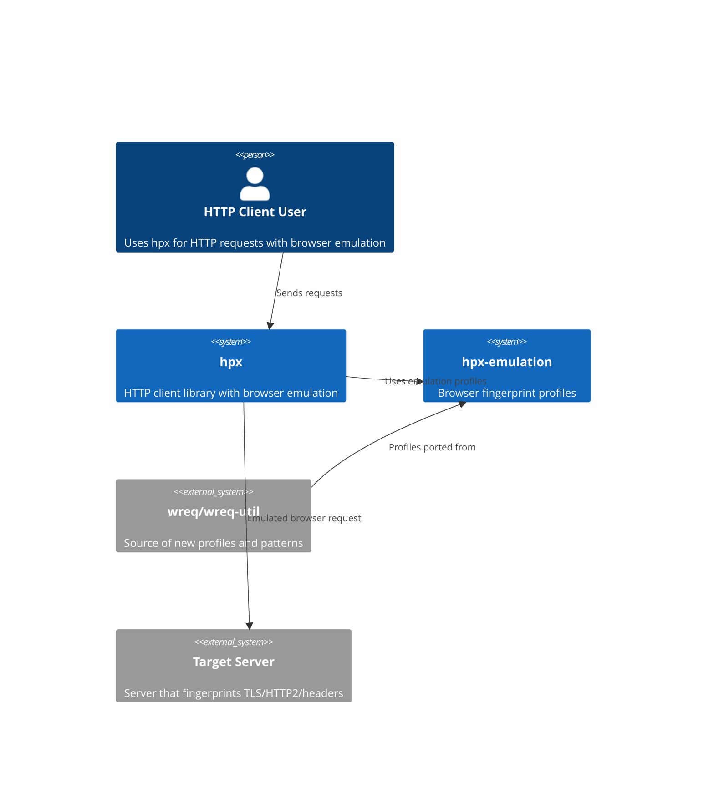
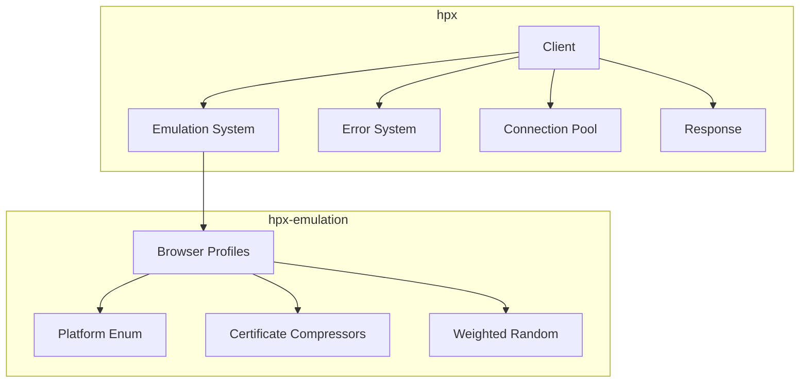
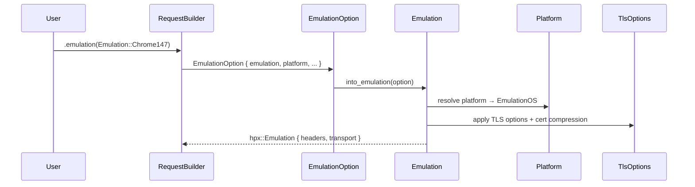
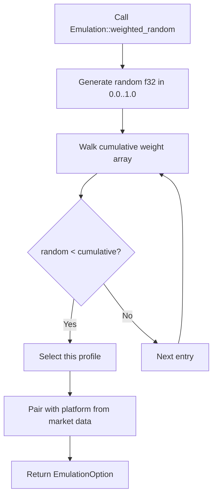

# Design: Absorb wreq/wreq-Util Features into hpx/hpx-Emulation

| Metadata | Details |
| :--- | :--- |
| **Author** | pb-plan agent |
| **Status** | Draft |
| **Created** | 2026-06-26 |
| **Scope** | Full |

## Executive Summary

**Problem:** hpx and hpx-emulation lag behind wreq/wreq-util in browser emulation coverage (missing ~40 browser versions), lack platform-aware fingerprinting, weighted random profile selection, and lack certificate compression implementations. The public Error type's `is_timeout()`/`is_connect()` checks only inspect direct kind, not the source chain, causing false negatives after multi-layer wrapping.

**Solution:** Systematically absorb 7 improvement areas from wreq/wreq-util: (1) update browser version coverage, (2) add Platform enum for OS-specific fingerprints, (3) add weighted random emulation selection, (4) add error source chain walking to public Error, (5) port TLS certificate compressors, (6) add `Response::forbid_recycle()` API, (7) introduce Group-based connection pool key for finer-grained isolation.

---

## 2. Source Inputs & Normalization

### 2.1 Source Materials

- `/Users/akagi201/tmp/wreq` — full source tree, Cargo.toml, all modules
- `/Users/akagi201/tmp/wreq-util` — full source tree, emulate/, tower/, macros
- Live codebase at `/Volumes/akext/src/github.com/longcipher/hpx`

### 2.2 Normalization Approach

Three subagents performed independent analysis: (1) wreq architecture explorer, (2) wreq-util feature extractor, (3) hpx/hpx-emulation codebase auditor. Findings were reconciled against live code using codegraph to verify current state of each module. Assumptions marked where wreq internals reference crates not present in hpx (e.g., `btls` vs `boring`).

### 2.3 Source Requirement Ledger

| Requirement ID | Source Summary | Type | Notes |
| :--- | :--- | :--- | :--- |
| `R1` | hpx-emulation missing Chrome 144-149, Firefox 137-151, Safari 19-26.4, Opera 118-131, Edge 143-148 | Functional | Browser fingerprint gap |
| `R2` | No Platform (OS) dimension in emulation profiles | Functional | wreq-util has Windows/macOS/Linux/Android/iOS |
| `R3` | `Emulation::random()` is uniform; no `weighted_random()` by market share | Functional | Useful for scraping traffic realism |
| `R4` | Public `Error::is_timeout()`/`is_connect()`/`is_dns()` don't walk source chain | Functional | Causes false negatives after layer wrapping |
| `R5` | No TLS 1.3 certificate compression implementations (Brotli/Zlib/Zstd) | Functional | Part of TLS fingerprint fidelity |
| `R6` | No `Response::forbid_recycle()` to poison connection from response side | Functional | wreq has this for detecting bad responses |
| `R7` | Connection pool uses simple host-based key; no Group-based multi-dimensional identity | Functional | Same host different emulations share pool slots |
| `R8` | Preserve all existing public APIs and behavior | Constraint | No breaking changes |
| `R9` | Follow AGENTS.md rules: scc, parking_lot, eyre, thiserror, tracing | Constraint | Per repo standards |
| `R10` | All new code must pass `clippy::pedantic`, `clippy::nursery`, `clippy::cargo` | Constraint | Per AGENTS.md |
| `R11` | BoringSSL-based TLS (not rustls) for emulation | Assumption trigger | hpx uses `boring` feature by default |
| `R12` | `wreq-util`'s macro-driven code generation (define_enum!, mod_generator!) should be adapted to hpx-emulation's existing macro system | Constraint | Reuse existing macros, don't import wreq-util's |

---

## Requirements & Goals

### 3.1 Problem Statement

hpx's browser emulation library covers ~80 versions while wreq-util covers ~120+. The missing versions (especially recent Chrome/Firefox/Safari) cause fingerprint detection on modern sites. The lack of platform-aware profiles means all fingerprints use the same OS regardless of context. Error diagnostic methods miss timeout/connect errors wrapped by tower layers. No certificate compression means TLS fingerprints don't match browsers that advertise compression.

### 3.2 Functional Requirements (EARS)

**Ubiquitous (always true):**

- **[REQ-01]:** The system *shall* provide emulation profiles for Chrome 100-149, Firefox 109-151, Safari 15.3-26.4, Opera 116-131, Edge 101-148, and OkHttp 3.9-5.
- **[REQ-02]:** The system *shall* support platform-specific (Windows/macOS/Linux/Android/iOS) TLS and header variations per browser profile.
- **[REQ-03]:** The system *shall* provide `Emulation::weighted_random()` that selects profiles weighted by browser market share.
- **[REQ-04]:** The public `Error` type *shall* walk the full source chain when checking `is_timeout()`, `is_connect()`, and `is_dns()`.

**Event-driven (triggered by event):**

- **[REQ-05]:** When a user calls `Response::forbid_recycle()`, the system *shall* mark the underlying connection as non-reusable.
- **[REQ-06]:** When a TLS connection is established with a browser emulation profile, the system *shall* apply certificate compression (Brotli/Zlib/Zstd) matching the emulated browser.

**State-driven (conditional on state):**

- **[REQ-07]:** While two requests use different emulation profiles but the same host, the system *shall* use separate connection pool entries.

**Unwanted (avoidance):**

- **[REQ-08]:** The system *shall not* break any existing public API signatures or behavior.
- **[REQ-09]:** The system *shall not* introduce new top-level dependencies without workspace-level approval.

### 3.3 Non-Functional Goals

- **Performance:** Emulation profile lookup must remain O(1). Weighted random must not allocate.
- **Reliability:** Error chain walking must not panic on deeply nested or circular chains.
- **Compatibility:** All new features must be feature-gated to avoid bloating minimal builds.

### 3.4 Out of Scope

- Tower delay middleware (hpx already has this)
- wreq's dual runtime (compio) support
- wreq's BoringSSL-specific `btls` dependency (hpx uses `boring`)
- wreq's `HeaderCaseName` type (hpx already has `OrigHeaderMap`)
- Browser profile auto-update mechanism (manual update only)

### 3.5 Assumptions

- hpx's existing `mod_generator!` macro system can be extended to support new browser versions without structural changes.
- The `boring` crate provides `CertificateCompressor` trait equivalent to wreq's `btls`.
- Connection pool Group key changes are backward-compatible (existing simple host keys still work as a subset).
- `rand` crate is already available in hpx-emulation (used by `Emulation::random()`).

### 3.6 Code Simplification Constraints (Ponytail Ladder)

- **YAGNI first:** Don't add Group-based pool keys if simple host keys suffice for 99% of use cases. Only add Group if the emulation × host isolation is measurably needed.
- **Existing deps only:** Certificate compression uses `brotli`, `flate2`, `zstd` crates already in dependency tree (via `tower-http` decompression).
- **One line where possible:** `is_timeout()` fix is a one-line change to use `walk_source_chain`.
- **Macro reuse:** New browser versions use existing `mod_generator!` pattern, not a new codegen system.

**Behavior Preservation Boundary:** All existing `Emulation` enum variants, `BrowserProfile`, `EmulationBuilder`, and `EmulationFactory` trait signatures remain unchanged. New variants are appended; new methods are added.

---

## 4. Requirements Coverage Matrix

| Requirement ID | EARS Pattern | Covered In Design | Scenario Coverage | Task Coverage | Status / Rationale |
| :--- | :--- | :--- | :--- | :--- | :--- |
| `R1` / REQ-01 | Ubiquitous | Section 9.1 | Browser version coverage scenarios | T2.1-T2.6 | Covered |
| `R2` / REQ-02 | Ubiquitous | Section 9.1 | Platform-aware emulation scenario | T3.1-T3.2 | Covered |
| `R3` / REQ-03 | Ubiquitous | Section 9.1 | Weighted random scenario | T3.3 | Covered |
| `R4` / REQ-04 | Ubiquitous | Section 9.2 | Error chain walking scenarios | T4.1 | Covered |
| `R5` / REQ-06 | Event-driven | Section 9.3 | Certificate compression scenario | T5.1 | Covered |
| `R6` / REQ-05 | Event-driven | Section 9.4 | Forbid recycle scenario | T6.1 | Covered |
| `R7` / REQ-07 | State-driven | Section 9.5 | Pool isolation scenario | T7.1 | Covered |
| `R8` / REQ-08 | Unwanted | All sections | Regression tests | All tasks | Constraint |
| `R9` / REQ-09 | Unwanted | All sections | Dependency audit | All tasks | Constraint |
| `R10` | Constraint | All sections | Clippy pass | All tasks | Constraint |
| `R11` | Assumption | Section 9.3 | TLS test | T5.1 | Assumption-bound |
| `R12` | Constraint | Section 9.1 | Macro test | T2.1 | Constraint |

---

## Architecture Overview

### 5.1 System Context (C4 Level 1)



### 5.2 Container Diagram (C4 Level 2)



### 5.3 Component Diagram (C4 Level 3)

```mermaid
graph LR
    subgraph Emulation
        E1[Emulation enum<br>120+ variants] --> E2[EmulationOption<br>+ Platform]
        E2 --> E3[EmulationFactory trait]
        E3 --> E4[build_emulation()]
    end

    subgraph CertCompress
        C1[BrotliCompressor] --> C2[CertificateCompressor trait]
        C3[ZlibCompressor] --> C2
        C4[ZstdCompressor] --> C2
    end

    subgraph Error
        ER1[Error] --> ER2[walk_source_chain]
        ER2 --> ER3[is_timeout/is_connect/is_dns]
    end
```

### 5.4 Key Design Principles

- **Extend, don't replace:** Add new enum variants and methods; don't restructure existing ones.
- **Feature-gate everything new:** Each improvement area behind its own feature flag.
- **Macro-driven generation:** New browser versions use existing `mod_generator!` macro pattern.
- **Source chain walking:** Reuse existing `walk_source_chain` helper in `error.rs` for all diagnostic methods.

### 5.5 Existing Components to Reuse

| Component | Location | How to Reuse |
| :--- | :--- | :--- |
| `mod_generator!` macro | `crates/hpx-emulation/src/emulation/macros.rs` | Stamp out new browser version modules |
| `define_enum!` macro | `crates/hpx-emulation/src/emulation/macros.rs` | Add new enum variants |
| `walk_source_chain()` | `crates/hpx/src/error.rs:300` | Use in `is_timeout()`/`is_connect()`/`is_dns()` |
| `EmulationOption` | `crates/hpx-emulation/src/emulation.rs` | Extend with Platform field |
| `Pool` shard system | `crates/hpx/src/client/http/client/pool.rs` | Extend key to support Group |
| `PoisonPill` | `crates/hpx/src/client/conn.rs` | Use for `forbid_recycle()` |
| `rand` crate | Already in hpx-emulation deps | Use for weighted random |

### 5.6 Project Identity Alignment

No template identity mismatches detected. All crate names match project identity.

---

## Architecture Decisions

### AD-01: Platform Enum Location

- **Status:** `Proposed`
- **Date:** 2026-06-26

**Context:** wreq-util puts `Platform` in `emulate.rs` alongside `Profile`. hpx-emulation already has `EmulationOS` in `emulation.rs`.

**Decision:** Add a `Platform` enum that maps to the existing `EmulationOS` enum, providing a user-friendly API that internally resolves to OS-specific TLS/header configs. `Platform` becomes a field on `EmulationOption`.

**Consequences:**

- Positive: Users get a clean `Platform::Windows` API; internal `EmulationOS` handles the actual fingerprint data.
- Negative: Two similar enums (`Platform` and `EmulationOS`) — but `Platform` is the public API, `EmulationOS` is internal.
- Neutral: `EmulationOption::builder().platform(Platform::Linux)` replaces `.emulation_os(EmulationOS::Linux)`.

### AD-02: Weighted Random Implementation

- **Status:** `Proposed`
- **Date:** 2026-06-26

**Context:** wreq-util uses market share percentages from StatCounter. hpx-emulation has uniform `random()`.

**Decision:** Add `Emulation::weighted_random()` with hardcoded market share weights. Use a const array of `(Emulation, f32)` pairs. Selection via cumulative distribution + `rand::random::<f32>()`.

**Consequences:**

- Positive: Realistic traffic distribution for scraping without manual tuning.
- Negative: Market share data becomes stale; needs periodic manual update.
- Neutral: `ponytail:` hardcoded weights, update by editing const array when stats change.

### AD-03: Error Source Chain Walking

- **Status:** `Proposed`
- **Date:** 2026-06-26

**Context:** `hpx::Error::is_timeout()` checks `Kind::Request` with `TimedOut` source, but doesn't walk deeper chains. `walk_source_chain()` exists but isn't used by all diagnostic methods.

**Decision:** Refactor `is_timeout()`, `is_connect()`, `is_dns()` on the public `hpx::Error` to use `walk_source_chain()` for deep inspection. Keep kind-based fast path for direct matches.

**Consequences:**

- Positive: Correctly identifies timeout/connect errors even after tower layer wrapping.
- Negative: Slightly more work per error check (walks chain). Negligible perf impact since error paths are cold.
- Neutral: Existing tests already verify `is_timeout()` with nested errors.

### AD-04: Certificate Compression Trait

- **Status:** `Proposed`
- **Date:** 2026-06-26

**Context:** wreq-util implements `CertificateCompressor` for Brotli/Zlib/Zstd. These are TLS 1.3 extensions that affect JA3/JA4 fingerprints. hpx uses `boring` crate which provides the `SslConnector::add_certificate_compression_algorithm()` API.

**Decision:** Implement `boring::ssl::CertificateCompressor` trait (or equivalent) for the three compressors in hpx-emulation. Wire them into emulation profiles that specify compression (Chrome=Brotli, Firefox/Safari=all three).

**Consequences:**

- Positive: TLS fingerprints match real browsers more accurately.
- Negative: Adds `brotli`, `flate2`, `zstd` as direct deps to hpx-emulation (already transitive via tower-http).
- Neutral: Feature-gated behind `emulation-compression`.

### AD-05: Group-based Connection Pool Key

- **Status:** `Proposed`
- **Date:** 2026-06-26

**Context:** Current pool key is `(Scheme, Authority)`. Two requests to the same host with different emulation profiles share a connection, which leaks fingerprint inconsistency.

**Decision:** Extend pool key to include an optional `Group` identifier derived from emulation profile hash. When unset (default), behavior is identical to current host-based key.

**Consequences:**

- Positive: Different emulations to same host get isolated connections.
- Negative: More pool entries for multi-emulation clients.
- Neutral: `ponytail:` only hash emulation if per-request emulation differs from client default.

### AD-06: Response::forbid_recycle()

- **Status:** `Proposed`
- **Date:** 2026-06-26

**Context:** wreq has `Response::forbid_recycle()` which poisons the connection from the response side, preventing pool reuse. Useful when a response indicates the connection is compromised.

**Decision:** Add `Response::forbid_recycle(&self)` that accesses the response's connection handle and sets the `PoisonPill` atomic flag.

**Consequences:**

- Positive: Users can prevent reuse of connections that returned suspicious responses.
- Negative: Requires response to carry a reference to the connection's PoisonPill.
- Neutral: `ponytail:` check if response extensions already carry Connected info; if not, add optional PoisonPill to response extensions.

### 5.7 Architecture Decision Snapshot Inputs

From `AGENTS.md`:

- Prefer `scc` over `dashmap`
- Prefer `parking_lot` over `std::sync`
- `eyre` for application errors, `thiserror` for library errors
- `tracing` only, no `log`
- `clippy::pedantic` + `clippy::nursery` + `clippy::cargo`

### 5.8 SRP / DIP Check

- **SRP:** Each improvement area (emulation profiles, error handling, pool keys, cert compression) stays in its own module. No cross-concern pollution.
- **DIP:** `CertificateCompressor` implementations depend on the `boring` crate's trait, not on concrete types. `Platform` maps to `EmulationOS` through a clean conversion.

### 5.9 BDD/TDD Strategy

- **BDD Runner:** `cucumber` (Rust crate)
- **BDD Command:** `cargo test --test features` (cucumber integration tests)
- **Unit Test Command:** `cargo test -p hpx -p hpx-emulation`
- **Property Test Tool:** `proptest` for weighted random distribution validation
- **Fuzz Test Tool:** N/A — no parser/protocol/unsafe work
- **Benchmark Tool:** N/A — no latency SLA for emulation profile lookup
- **Outer Loop:** Feature scenarios in `features/` verify end-to-end emulation behavior
- **Inner Loop:** Unit tests in `#[cfg(test)]` modules verify each component

### 5.10 BDD Scenario Inventory

| Feature File | Scenario | Business Outcome | Primary Verification | Supporting TDD Focus |
| :--- | :--- | :--- | :--- | :--- |
| `features/emulation-profiles.feature` | All major browser versions available | Users can emulate any major browser | `cargo test -p hpx-emulation` | Enum variant count test |
| `features/emulation-profiles.feature` | Platform-specific emulation | OS-accurate fingerprints | `cargo test -p hpx-emulation` | Platform→EmulationOS mapping |
| `features/emulation-profiles.feature` | Weighted random distribution | Realistic traffic profile | `cargo test -p hpx-emulation` | Distribution chi-squared test |
| `features/error-diagnostics.feature` | Timeout detected through tower layers | Accurate error classification | `cargo test -p hpx` | Source chain walking unit test |
| `features/error-diagnostics.feature` | Connect error detected through layers | Accurate error classification | `cargo test -p hpx` | Source chain walking unit test |
| `features/cert-compression.feature` | Browser-appropriate compression applied | Accurate TLS fingerprint | `cargo test -p hpx-emulation` | Compressor trait impl tests |
| `features/connection-pool.feature` | Different emulations get separate pool entries | Fingerprint isolation | `cargo test -p hpx` | Pool key hash test |
| `features/connection-pool.feature` | Response::forbid_recycle prevents reuse | Connection poisoning | `cargo test -p hpx` | PoisonPill test |

### 5.11 Simplification Opportunities in Touched Code

| Area | Current Complexity | Planned Simplification | Why It Preserves Behavior |
| :--- | :--- | :--- | :--- |
| `Emulation::random()` | Uniform distribution, separate from `EmulationOS` | Merge OS selection into weighted random | Same output type, better distribution |
| `is_timeout()` | Only checks direct kind | Use existing `walk_source_chain` | Strictly more correct, same API |

---

## Data Models

No database or schema changes. All data is in-memory Rust types.

---

## Interface Contracts

### 8.1 Public API (External)

No new HTTP endpoints. All changes are library API additions.

### 8.2 Internal Module Contracts (Type Signatures)

```rust
// crates/hpx-emulation/src/emulation.rs
#[derive(Debug, Clone, Copy, PartialEq, Eq, Hash, Default)]
pub enum Platform {
    #[default]
    Windows,
    MacOS,
    Linux,
    Android,
    IOS,
}

impl Platform {
    pub fn is_mobile(self) -> bool { ... }
    pub fn user_agent_suffix(self) -> &'static str { ... }
}

// Existing EmulationOption gains platform field:
impl EmulationOption {
    pub fn platform(mut self, p: Platform) -> Self { ... }
}

// crates/hpx-emulation/src/emulation/rand.rs
impl Emulation {
    pub fn weighted_random() -> EmulationOption { ... }
}

// crates/hpx-emulation/src/emulation/compress.rs
pub struct BrotliCompressor;
pub struct ZlibCompressor;
pub struct ZstdCompressor;

// crates/hpx/src/error.rs (existing, modified)
impl Error {
    // Now walks source chain:
    pub fn is_timeout(&self) -> bool { ... }
    pub fn is_connect(&self) -> bool { ... }
    pub fn is_dns(&self) -> bool { ... }
}

// crates/hpx/src/client/response.rs (new method)
impl Response {
    pub fn forbid_recycle(&self) { ... }
}
```

### 8.3 Error Contracts

No new error types. Existing `Error` kind enum gains no new variants — the change is in how existing kinds are detected through source chain walking.

---

## Detailed Design

### 9.1 Module Structure

```text
crates/hpx-emulation/src/
├── emulation/
│   ├── macros.rs           # Existing — extend define_enum! for new variants
│   ├── rand.rs             # Modified — add weighted_random()
│   ├── compress.rs         # NEW — BrotliCompressor, ZlibCompressor, ZstdCompressor
│   ├── device/
│   │   ├── chrome/         # Extended — add v144-v149 modules
│   │   ├── firefox/        # Extended — add v137-v151 modules
│   │   ├── safari/         # Extended — add v19-v26 modules + iOS/iPad variants
│   │   ├── opera/          # Extended — add v118-v131 modules
│   │   ├── edge/           # Extended — add v143-v148 modules
│   │   └── okhttp.rs       # Existing — no changes
│   └── emulation.rs        # Modified — add Platform enum
crates/hpx/src/
├── error.rs                # Modified — refactor is_timeout/is_connect/is_dns
├── client/
│   ├── response.rs         # Modified — add forbid_recycle()
│   └── http/
│       └── client/
│           └── pool.rs     # Modified — optional Group-aware key
```

### 9.2 Logic Flow

**Emulation profile resolution:**



**Weighted random selection:**



### 9.3 Configuration

New feature flags in `hpx-emulation/Cargo.toml`:

- `emulation-compression` — enables cert compression implementations
- Existing `emulation-rand` — extended to include `weighted_random()`

### 9.4 Error Handling

- Certificate compression: compressor errors are logged via `tracing::warn` and silently skipped (graceful degradation).
- Weighted random: panics if weight array is empty (impossible with hardcoded data, but assert in debug).
- Group pool key: falls back to host-only key if emulation hash is zero.

### 9.5 Maintainability Notes

- New browser version modules follow exact same pattern as existing ones (copy + adjust constants).
- `Platform` enum is deliberately small (5 variants) to match real-world OS differences in TLS fingerprints.
- `walk_source_chain` is already a well-tested utility; extending its use is low-risk.

---

## Verification & Testing Strategy

### 10.1 Unit Testing

| Target | Test | Location |
| :--- | :--- | :--- |
| `Platform` enum | `is_mobile()`, conversion to `EmulationOS` | `crates/hpx-emulation/src/emulation.rs #[cfg(test)]` |
| `weighted_random()` | Distribution test (chi-squared) | `crates/hpx-emulation/src/emulation/rand.rs #[cfg(test)]` |
| `is_timeout()` source chain | Nested timeout error detection | `crates/hpx/src/error.rs #[cfg(test)]` |
| `is_connect()` source chain | Nested connect error detection | `crates/hpx/src/error.rs #[cfg(test)]` |
| `is_dns()` source chain | Nested DNS error detection | `crates/hpx/src/error.rs #[cfg(test)]` |
| `forbid_recycle()` | Connection poisoned after call | `crates/hpx/src/client/response.rs #[cfg(test)]` |
| Certificate compressors | Round-trip compress/decompress | `crates/hpx-emulation/src/emulation/compress.rs #[cfg(test)]` |
| Browser variant count | All expected versions present | `crates/hpx-emulation/src/emulation.rs #[cfg(test)]` |

### 10.2 Property Testing

| Target | Why Property Testing Helps | Tool / Command | Planned Invariants |
| :--- | :--- | :--- | :--- |
| `weighted_random()` | Distribution must approximate market shares | `proptest` | Frequencies within 5% of target weights over 10k samples |

### 10.3 Integration Testing

- Emulation profile → TLS handshake → verify JA3 fingerprint matches expected browser.
- Different emulation profiles to same host → verify separate pool entries.
- `forbid_recycle()` → verify connection not reused on next request.

### 10.4 BDD Acceptance Testing

| Scenario ID | Feature File | Command | Success Criteria |
| :--- | :--- | :--- | :--- |
| BDD-01 | `features/emulation-profiles.feature` | `cargo test -p hpx-emulation` | All scenarios pass |
| BDD-02 | `features/error-diagnostics.feature` | `cargo test -p hpx` | All scenarios pass |
| BDD-03 | `features/cert-compression.feature` | `cargo test -p hpx-emulation` | All scenarios pass |
| BDD-04 | `features/connection-pool.feature` | `cargo test -p hpx` | All scenarios pass |

### 10.5 Robustness & Performance Testing

| Test Type | When Required | Tool / Command | Coverage |
| :--- | :--- | :--- | :--- |
| Fuzz | N/A | — | No parser/protocol/unsafe work |
| Benchmark | N/A | — | No latency SLA for emulation lookup |

### 10.6 Critical Path Verification

| Verification Step | Command | Success Criteria |
| :--- | :--- | :--- |
| VP-01 | `cargo test -p hpx-emulation` | All tests pass |
| VP-02 | `cargo test -p hpx` | All tests pass |
| VP-03 | `cargo clippy -p hpx -p hpx-emulation -- -D warnings` | No warnings |
| VP-04 | `cargo test --workspace` | No regressions |

### 10.7 Validation Rules

| Test Case ID | EARS Requirement | Action | Expected Outcome | Verification Method |
| :--- | :--- | :--- | :--- | :--- |
| TC-01 | REQ-01 | Count `Emulation` variants | ≥ 120 versions | `assert!(Emulation::VARIANTS.len() >= 120)` |
| TC-02 | REQ-02 | `Platform::Linux.user_agent_suffix()` | Contains "Linux" | String assertion |
| TC-03 | REQ-03 | `weighted_random()` × 10000 | Chrome ≈ 71% | Chi-squared test |
| TC-04 | REQ-04 | `Error::request(TimedOut)` wrapped in tower elapsed | `is_timeout() == true` | Unit test |
| TC-05 | REQ-05 | Call `forbid_recycle()` then drop | Connection not in pool | Pool count assertion |
| TC-06 | REQ-06 | Chrome profile with compression | Brotli compressor attached | Compressor type check |
| TC-07 | REQ-07 | Same host, different emulations | Separate pool entries | Pool entry count |

---

## Implementation Plan

- [ ] **Phase 1: Foundation** — Platform enum, error chain walking, forbid_recycle
- [ ] **Phase 2: Browser Profiles** — Add missing versions (Chrome 144-149, Firefox 137-151, etc.)
- [ ] **Phase 3: Emulation Enhancements** — Weighted random, cert compression, pool Group key
- [ ] **Phase 4: Polish** — Tests, clippy, integration verification

---

## Cross-Functional Concerns

- **Backward compatibility:** All changes are additive. No existing API signatures change.
- **Feature flags:** New features behind `emulation-compression`, `emulation-rand`, `cookies` (for pool Group).
- **Documentation:** New public methods get `/// doc comments` with examples.
- **Security:** Certificate compression uses well-vetted `brotli`/`flate2`/`zstd` crates; no custom crypto.
