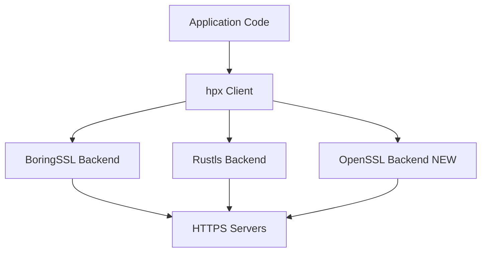
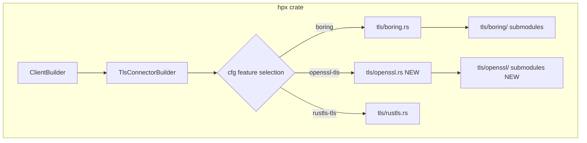
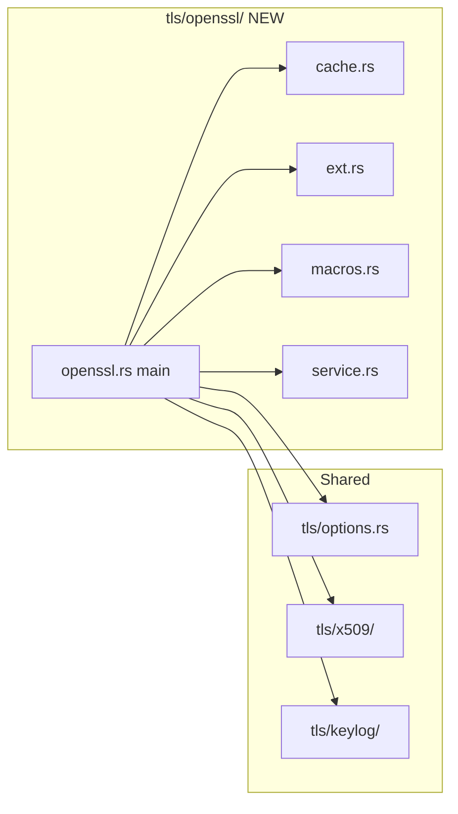
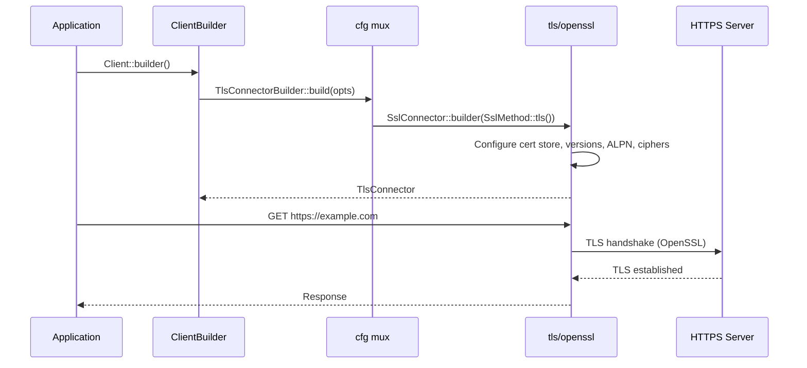

# Design Document: OpenSSL TLS Backend

| Metadata | Details |
| :--- | :--- |
| **Author** | pb-plan agent |
| **Status** | Draft |
| **Created** | 2026-07-05 |
| **Reviewers** | N/A |
| **Related Issues** | N/A |

## Executive Summary

> **Problem:** hpx currently supports only BoringSSL (default) and Rustls as TLS backends. Enterprise environments with existing OpenSSL infrastructure, OpenSSL-specific compliance requirements, or platforms where OpenSSL is the only available/audited TLS library cannot use hpx without forcing an additional TLS dependency.
> **Solution:** Add OpenSSL as a third, opt-in TLS backend by leveraging the API-level homology between `boring` and `openssl` Rust crates (both originate from Steven Fackler's `openssl` crate). The implementation clones `tls/boring/` as `tls/openssl/` with mechanical crate-name substitutions and graceful degradation of BoringSSL-specific fingerprinting features.

---

## 2. Source Inputs & Normalization

### 2.1 Source Materials

- User-provided detailed architecture analysis covering: current TLS backend structure, Cargo.toml feature layout, BoringSSL↔OpenSSL API mapping, browser fingerprinting degradation strategy, cross-platform compilation concerns, hpx-emulation coordination, and test strategy.
- Live codebase inspection of `crates/hpx/src/tls/`, `crates/hpx/Cargo.toml`, `crates/hpx-emulation/`, and workspace root `Cargo.toml`.

### 2.2 Normalization Approach

The user's analysis was cross-referenced against live codebase evidence. All file paths, type names, and API surface claims were verified against the actual source. Two subagent roles were used: (1) Source Requirements Analyst to extract the requirement ledger from the user's narrative, and (2) Codebase Analyst to verify TLS module structure, feature flags, and integration points.

### 2.3 Source Requirement Ledger

| Requirement ID | Source Summary | Type | Notes |
| :--- | :--- | :--- | :--- |
| `R1` | Add OpenSSL as a third TLS backend alongside BoringSSL and Rustls | Functional | Must not break existing backends |
| `R2` | New `openssl-tls` feature flag in `crates/hpx/Cargo.toml` | Functional | Mutually exclusive with `boring` and `rustls-tls` via cfg precedence |
| `R3` | Add `openssl-vendored` sub-feature for static compilation | Functional | `openssl/vendored` passthrough |
| `R4` | Clone `tls/boring/` module as `tls/openssl/` with crate substitutions | Functional | Mechanical: `boring` → `openssl`, `tokio_boring` → `tokio_openssl` |
| `R5` | Graceful degradation of BoringSSL-specific browser fingerprinting features | Constraint | GREASE, ECH, ALPS, extension permutation unavailable in OpenSSL |
| `R6` | Conditional compilation in `tls/mod.rs`, `tls/conn.rs`, `tls/x509/` | Functional | Follow existing `cfg` patterns |
| `R7` | hpx-emulation must compile and run with `openssl-tls` backend | Constraint | BoringSSL-specific fingerprint fields become no-ops or return warnings |
| `R8` | Identity (client cert) support: `from_pem`, `from_pkcs8_pem`, `from_pkcs12_der` | Functional | OpenSSL crate provides equivalent X509/PKey/Pkcs12 APIs |
| `R9` | Session cache (`SessionCache`) must work with OpenSSL backend | Functional | `SslSession`, `SslSessionCacheMode` APIs exist in `openssl` crate |
| `R10` | Cross-platform compilation support (musl, macOS, Linux) | Constraint | Vendored feature or `OPENSSL_DIR` env var |
| `R11` | Workspace root `Cargo.toml` must declare `openssl` and `tokio-openssl` in `[workspace.dependencies]` | Constraint | Follow AGENTS.md workspace dependency rules |
| `R12` | Existing `boring` and `rustls-tls` backends must remain unchanged | Non-goal | No regressions to current functionality |

---

## Requirements & Goals

### 3.1 Problem Statement

hpx's TLS backend selection is limited to BoringSSL (default, full browser fingerprinting) and Rustls (pure Rust, reduced fingerprinting). Organizations with OpenSSL-based security infrastructure, FIPS compliance requirements, or platforms where only OpenSSL is available/audited cannot adopt hpx without introducing a foreign TLS library. The `boring` and `openssl` Rust crates share a common ancestry (both forked from Steven Fackler's `openssl` crate), making their SSL module APIs nearly identical — this creates a natural opportunity for minimal-effort OpenSSL support.

### 3.2 Functional Requirements (EARS)

**Ubiquitous (always true):**

- **[REQ-01]:** The system *shall* provide an `openssl-tls` feature flag that enables OpenSSL as a TLS backend, mutually exclusive with `boring` and `rustls-tls` at the cfg-compilation level.
- **[REQ-02]:** The system *shall* provide an `openssl-vendored` feature that enables static compilation of OpenSSL from source.
- **[REQ-03]:** While `openssl-tls` is enabled, the system *shall* expose the same public TLS API surface (`TlsConnector`, `TlsConnectorBuilder`, `HttpsConnector`, `MaybeHttpsStream`, `HandshakeConfig`) as the BoringSSL backend.

**State-driven (conditional on state):**

- **[REQ-04]:** While `openssl-tls` is enabled and `boring` is also enabled, the system *shall* prefer the `boring` backend (following the existing precedence pattern `cfg(all(feature = "rustls-tls", not(feature = "boring")))`).
- **[REQ-05]:** While `openssl-tls` is enabled, the system *shall* support `Identity::from_pem`, `Identity::from_pkcs8_pem`, and `Identity::from_pkcs12_der` for client certificate authentication.

**Event-driven (triggered by event):**

- **[REQ-06]:** When a TLS connection is initiated under `openssl-tls`, the system *shall* perform session cache lookup, ALPN negotiation, SNI configuration, and certificate verification identically to the BoringSSL backend where OpenSSL supports it.

**Unwanted (avoidance):**

- **[REQ-07]:** If `openssl-tls` is enabled, the system *shall not* silently fail when BoringSSL-specific features (GREASE, ECH, ALPS, extension permutation, certificate compression) are requested; it *shall* treat them as no-ops with optional tracing warnings.
- **[REQ-08]:** The `openssl-tls` feature *shall not* modify any code in `tls/boring/`, `tls/rustls/`, or their submodules.

**Exception (conditional exception):**

- **[REQ-09]:** Where hpx-emulation produces TLS fingerprint configurations that reference BoringSSL-specific APIs, the system *shall* compile successfully under `openssl-tls` and silently skip unsupported fingerprint fields.

### 3.3 Non-Functional Goals

- **Performance:** OpenSSL backend session cache uses the same sharded `SessionCache` design as BoringSSL — O(1) lookup per shard. No additional allocations on the hot path beyond what the BoringSSL backend already requires.
- **Security:** OpenSSL backend MUST support the same certificate verification modes (`PEER`, `NONE`) and TLS version bounds (1.2/1.3) as the BoringSSL backend.
- **Compatibility:** The `openssl` crate version 0.10.x and `tokio-openssl` 0.6.x are the target versions, matching the latest stable releases.
- **Cross-compilation:** Vendored OpenSSL compilation must work for `x86_64-unknown-linux-musl`, `x86_64-apple-darwin`, and `aarch64-apple-darwin` targets.

### 3.4 Out of Scope

- Full JA3/JA4 fingerprint matching with OpenSSL (OpenSSL cannot replicate Chrome/Firefox JA3 signatures).
- OpenSSL 3.x-specific features (e.g., provider-based API) — target the `openssl` crate's stable 0.10.x API surface.
- FIPS compliance mode — while OpenSSL can be FIPS-validated, configuring FIPS mode is out of scope.
- Custom OpenSSL engine/loader integration.
- Modifying `hpx-emulation`'s fingerprint generation logic — only cfg-gating its BoringSSL-specific output.

### 3.5 Assumptions

- **A1:** The `openssl` crate's `ssl` module exposes `SslConnector`, `SslSession`, `SslSessionCacheMode`, `SslVerifyMode`, `SslMethod`, `SslOptions`, `SslRef`, `SslConnectorBuilder` with APIs compatible to the `boring` crate's equivalents.
- **A2:** The `openssl` crate's `set_curves_list`, `set_sigalgs_list`, `set_cipher_list`, `set_alpn_protos` methods exist and accept the same string/byte formats.
- **A3:** BoringSSL-specific methods (`set_grease_enabled`, `set_enable_ech_grease`, `set_permute_extensions`, `set_extension_permutation`, ALPS-related, `set_preserve_tls13_cipher_list`, `set_delegated_credentials`, `set_record_size_limit`, `set_key_shares_limit`, `set_aes_hw_override`) do NOT exist in the `openssl` crate and must be gated as no-ops.
- **A4:** Certificate compression (RFC 8879) is NOT supported by the `openssl` crate — `cert_compression.rs` will not be ported.
- **A5:** The `openssl` crate's `ex_data` API (`Ssl::new_ex_index`, `set_ex_data`, `ex_data`) works identically for session cache key storage.

### 3.6 Code Simplification Constraints (Ponytail Ladder)

1. Does this need to exist? Yes — enterprise OpenSSL infrastructure requirement is explicit.
2. Stdlib? No — TLS is not in Rust stdlib.
3. Native? No.
4. Existing dep? No — `openssl` and `tokio-openssl` are new dependencies.
5. One line? No — requires module cloning with API adaptation.
6. Minimum code: Clone existing `tls/boring/` with mechanical substitutions. No new abstractions.

**Behavior Preservation Boundary:** All existing BoringSSL and Rustls backend code must remain byte-identical. No changes to `tls/boring.rs`, `tls/boring/`, `tls/rustls.rs`, or `tls/x509/` (except adding `cfg(feature = "openssl-tls")` branches where needed).

**Repo Standards To Follow:** Workspace dependency rules from AGENTS.md (use `cargo add --workspace`, numeric versions only in root, `workspace = true` in sub-crates). Strict lint compliance (`deny(unwrap_used, expect_used)` in library code). No `unsafe` beyond what already exists in the BoringSSL session cache path.

---

## 4. Requirements Coverage Matrix

| Requirement ID | EARS Pattern | Covered In Design | Scenario Coverage | Task Coverage | Status / Rationale |
| :--- | :--- | :--- | :--- | :--- | :--- |
| `R1` | Ubiquitous | AD-01, §9.1 | `openssl-tls-backend-connect` | Task 2.1–2.4 | Covered |
| `R2` | Ubiquitous | AD-01, §9.3 | N/A (config) | Task 1.1 | Covered |
| `R3` | Ubiquitous | AD-02, §9.3 | N/A (config) | Task 1.1 | Covered |
| `R4` | Ubiquitous | AD-03, §9.1 | All scenarios | Task 2.1–2.4 | Covered |
| `R5` | Unwanted | AD-04, §9.4 | `fingerprint-degradation` | Task 2.3 | Covered |
| `R6` | Ubiquitous | AD-01, §9.1 | N/A (config) | Task 2.1 | Covered |
| `R7` | Unwanted | AD-04 | `emulation-compat` | Task 3.1 | Covered |
| `R8` | State-driven | §9.2 | `openssl-tls-identity` | Task 2.2 | Covered |
| `R9` | Ubiquitous | AD-03 | `session-cache` | Task 2.4 | Covered |
| `R10` | Constraint | AD-02 | N/A | Task 4.2 | Covered |
| `R11` | Constraint | §9.1 | N/A | Task 1.1 | Covered |
| `R12` | Non-goal | AD-01 | All scenarios | All tasks | Covered |

---

## Architecture Overview

### 5.1 System Context (C4 Level 1)



### 5.2 Container Diagram (C4 Level 2)



### 5.3 Component Diagram (C4 Level 3)



### 5.4 Key Design Principles

- **Parallel module coexistence:** OpenSSL backend lives in `tls/openssl/` alongside `tls/boring/` — no shared abstraction layer, no trait-based dispatch.
- **Cfg-driven mutual exclusivity:** Feature precedence: `boring` > `openssl-tls` > `rustls-tls`. Only one backend is active at compile time.
- **Graceful degradation:** BoringSSL-specific TLS options (GREASE, ECH, ALPS, extension permutation, certificate compression) are silently no-op'd under OpenSSL, following the same pattern the Rustls backend already uses.
- **Mechanical derivation:** The OpenSSL module is derived from the BoringSSL module via systematic crate-name substitution, not hand-written from scratch.

### 5.5 Existing Components to Reuse

| Component | Location | How to Reuse |
| :--- | :--- | :--- |
| `SessionCache<T>` | `crates/hpx/src/tls/boring/cache.rs` | Clone to `tls/openssl/cache.rs`, replace `boring::ssl::SslSession` with `openssl::ssl::SslSession` |
| `SslConnectorBuilderExt` trait | `crates/hpx/src/tls/boring/ext.rs` | Clone, adapt for OpenSSL's `SslConnectorBuilder` (cert store, cert verification, compression — note: compression not available) |
| `set_bool!`, `set_option!`, etc. | `crates/hpx/src/tls/boring/macros.rs` | Direct copy — macros are crate-agnostic |
| `tower::Service` impls | `crates/hpx/src/tls/boring/service.rs` | Clone, replace `tokio_boring::SslStream` with `tokio_openssl::SslStream` |
| `TlsOptions`, `TlsOptionsBuilder` | `crates/hpx/src/tls/options.rs` | Add `cfg(feature = "openssl-tls")` branches for BoringSSL-only fields |
| `Identity`, `Certificate`, `CertStore` | `crates/hpx/src/tls/x509/` | Add `cfg(feature = "openssl-tls")` branches alongside existing `boring`/`rustls-tls` |
| `KeyLog`, `Handle` | `crates/hpx/src/tls/keylog/` | Reuse directly — backend-agnostic |
| mTLS test fixtures | `crates/hpx/tests/support/mtls/` | Reuse cert/key files for OpenSSL backend tests |

### 5.6 Project Identity Alignment

No template identity mismatches detected. The project uses its own identity (`hpx`) consistently.

---

## Architecture Decisions

### AD-01: Parallel Module Without Shared Abstraction

- **Status:** Proposed
- **Date:** 2026-07-05

**Context:**
The existing codebase uses cfg-based module selection (not trait-based dispatch) for TLS backends. Introducing a `TlsBackend` trait would require refactoring both existing backends and the connector layer, violating the "minimal change" principle.

**Decision:**
Clone `tls/boring/` as `tls/openssl/` and add a third `cfg` branch following the existing pattern. No new traits or abstractions.

**Consequences:**

- Positive: Zero risk to existing backends. Minimal code review surface.
- Negative: Three parallel modules with duplicated boilerplate.
- Neutral: Follows the established pattern — no new architectural debt.

### AD-02: Vendored OpenSSL as Separate Feature

- **Status:** Proposed
- **Date:** 2026-07-05

**Context:**
OpenSSL's C dependency requires either a system-installed OpenSSL or a vendored (source-compiled) build. Different deployment scenarios need different approaches.

**Decision:**
Expose `openssl-vendored` as a separate feature that implies `openssl-tls` and enables `openssl/vendored`. The base `openssl-tls` feature requires system OpenSSL.

**Consequences:**

- Positive: Users with system OpenSSL avoid unnecessary compilation. Cross-compilation scenarios have a clear path.
- Negative: Two features instead of one to remember.
- Neutral: Matches the pattern used by `reqwest` and other ecosystem crates.

### AD-03: Feature Precedence Order

- **Status:** Proposed
- **Date:** 2026-07-05

**Context:**
When multiple TLS features are enabled simultaneously, the codebase must select exactly one backend. The existing pattern gives `boring` precedence over `rustls-tls`.

**Decision:**
Precedence: `boring` > `openssl-tls` > `rustls-tls`. Implementation: `cfg(feature = "openssl-tls")` branches are gated with `not(feature = "boring")`, and `rustls-tls` branches are gated with `not(feature = "boring")` and `not(feature = "openssl-tls")`.

**Consequences:**

- Positive: Consistent with existing precedence pattern. BoringSSL (full fingerprinting) is always preferred when available.
- Negative: Users enabling both `boring` and `openssl-tls` silently get BoringSSL.
- Neutral: This is already how `rustls-tls` behaves when `boring` is also enabled.

### AD-04: BoringSSL-Specific Feature Degradation Strategy

- **Status:** Proposed
- **Date:** 2026-07-05

**Context:**
Several `TlsOptions` fields and `SslConnectorBuilder` methods are BoringSSL-specific (GREASE, ECH, ALPS, extension permutation, certificate compression, etc.). The Rustls backend already silently ignores these.

**Decision:**
In the OpenSSL backend, BoringSSL-specific options are treated as no-ops. Where the `openssl` crate lacks an equivalent method (e.g., `set_grease_enabled`, `set_enable_ech_grease`, ALPS, certificate compression), the corresponding `set_bool!`/`set_option!` macro invocations are omitted or wrapped in `#[cfg(feature = "boring")]`. A `tracing::debug!` message is emitted for the most significant omissions (ECH, ALPS) to aid debugging.

**Consequences:**

- Positive: No compilation errors. Consistent with Rustls backend behavior.
- Negative: Users expecting full browser fingerprinting with OpenSSL will not get it.
- Neutral: Documented limitation, same as Rustls.

### 5.7 Architecture Decision Snapshot Inputs

Inherited from existing codebase:

- `cfg`-based backend selection (no trait abstraction)
- `boring` takes precedence when multiple TLS features enabled
- `TlsOptions` as the backend-agnostic configuration carrier
- Sharded `SessionCache` for TLS session resumption
- `tower::Service` layer pattern for connector wrapping

### 5.8 SRP / DIP Check

- **SRP Check:** The OpenSSL module is solely responsible for OpenSSL-based TLS connection establishment. It does not absorb browser fingerprinting logic (that stays in `hpx-emulation`), HTTP/2 settings (that stays in the client layer), or certificate parsing utilities (shared via `tls/x509/`).
- **DIP Check:** No new dependency inversion is needed. The connector layer (`client/conn/connector.rs`) already depends on `TlsConnector`/`TlsConnectorBuilder` types that are re-exported through `tls/conn.rs` — the cfg mux handles the indirection.
- **Dependency Injection Plan:** OpenSSL types flow through the same `tls/conn.rs` re-export layer as BoringSSL types. No new interfaces needed.

### 5.8a Performance Impact Assessment

| Decision | Performance Characteristic | Risk | Mitigation |
| :--- | :--- | :--- | :--- |
| Sharded SessionCache (clone from boring) | O(1) per-shard lookup, same as BoringSSL | None — identical algorithm | Direct reuse |
| SslConnector::builder per-connection | Same allocation pattern as BoringSSL | Negligible — OpenSSL connection setup is dominated by handshake | No change needed |

### 5.9 BDD/TDD Strategy

- **BDD Runner:** `cucumber` (crate-level, if BDD is needed — this feature is infrastructure-level, not business-logic-driven)
- **BDD Command:** N/A — TLS backend selection is not user-facing business behavior suitable for Gherkin scenarios
- **Unit Test Command:** `cargo nextest run -p hpx --features openssl-tls --no-default-features --features http1,http2,stream,tracing`
- **Property Test Tool:** `proptest` — for session cache shard routing stability (clone existing BoringSSL proptest cases)
- **Fuzz Test Tool:** N/A — TLS handshake is handled by OpenSSL's C library; Rust-level parsing is minimal
- **Benchmark Tool:** N/A — no explicit latency/throughput SLA for this feature
- **Outer Loop:** Integration test: mTLS connection with OpenSSL backend against a local OpenSSL server
- **Inner Loop:** Unit tests: session cache operations, TLS version bounds, identity parsing, connector builder configuration
- **Step Definition Location:** N/A (no BDD)

### 5.10 BDD Scenario Inventory

N/A — TLS backend selection is infrastructure-level configuration, not user-facing business behavior. Gherkin scenarios are not appropriate here. Verification is through unit tests, integration tests, and compilation checks.

### 5.11 Simplification Opportunities in Touched Data

| Area | Current Complexity or Smell | Planned Simplification | Why It Preserves or Clarifies Behavior |
| :--- | :--- | :--- | :--- |
| `tls/boring.rs` build method | Many commented-out BoringSSL-specific option setters | Clone as-is, mark commented sections with `// [openssl] not available` | Makes the degradation explicit and traceable |
| `tls/options.rs` cfg branches | Only `#[cfg(feature = "boring")]` for cert compression and extension permutation | Add `#[cfg(any(feature = "boring", feature = "openssl-tls"))]` where OpenSSL supports the option, keep `boring`-only where it doesn't | Clarifies which options each backend supports |

---

## Interface Contracts

### 8.1 Public API (External)

No new public API surface. The OpenSSL backend exposes the same types as BoringSSL through `tls/conn.rs`:

```rust
// Re-exported via tls/conn.rs when cfg(feature = "openssl-tls") and not cfg(feature = "boring")
pub use crate::tls::openssl::{
    HandshakeConfig, HandshakeConfigBuilder,
    HttpsConnector, MaybeHttpsStream, EstablishedConn,
    TlsConnector, TlsConnectorBuilder,
};
pub use tokio_openssl::SslStream;
```

### 8.2 Internal Module Contracts (Type Signatures)

The OpenSSL module mirrors the BoringSSL module's public interface:

```rust
// tls/openssl.rs — same signatures as tls/boring.rs
pub struct HandshakeConfig { /* same fields minus BoringSSL-only ones */ }
pub struct HandshakeConfigBuilder { /* same */ }
pub struct HttpsConnector<T> { http: T, inner: Inner }
pub struct TlsConnectorBuilder { /* same fields */ }
pub struct TlsConnector { inner: Inner }
pub enum MaybeHttpsStream<T> { Http(T), Https(tokio_openssl::SslStream<T>) }
pub struct EstablishedConn<IO> { io: IO, req: ConnectRequest }
```

### 8.3 Error Contracts

Same error types as existing backends — `crate::Error::tls()` wraps `openssl::error::ErrorStack` (same shape as `boring::error::ErrorStack`).

---

## Detailed Design

### 9.1 Module Structure

```text
crates/hpx/src/tls/
├── boring.rs              # [UNCHANGED]
├── boring/                # [UNCHANGED]
│   ├── cache.rs
│   ├── cert_compression.rs
│   ├── ext.rs
│   ├── macros.rs
│   └── service.rs
├── openssl.rs             # [NEW] Cloned from boring.rs with substitutions
├── openssl/               # [NEW] Cloned from boring/ with substitutions
│   ├── cache.rs           # SslSession from openssl crate
│   ├── ext.rs             # SslConnectorBuilderExt for openssl
│   ├── macros.rs          # Direct copy (crate-agnostic)
│   └── service.rs         # tokio_openssl::SslStream
├── rustls.rs              # [UNCHANGED]
├── conn.rs                # [MODIFIED] Add openssl-tls cfg branch
├── options.rs             # [MODIFIED] Add openssl-tls cfg branches
├── x509.rs                # [MODIFIED] Add openssl-tls cfg branch
├── x509/
│   ├── identity.rs        # [MODIFIED] Add openssl-tls cfg branch
│   ├── parser.rs          # [MODIFIED] Add openssl-tls cfg branch
│   └── store.rs           # [MODIFIED] Add openssl-tls cfg branch
└── ...
```

Note: `cert_compression.rs` is NOT cloned — OpenSSL does not support RFC 8879 certificate compression.

### 9.2 Logic Flow



### 9.3 Configuration

**New Cargo features in `crates/hpx/Cargo.toml`:**

```toml
[features]
openssl-tls = ["dep:openssl", "dep:tokio-openssl", "dep:brotli", "dep:flate2"]
openssl-vendored = ["openssl-tls", "openssl/vendored"]
```

**New workspace dependencies in root `Cargo.toml`:**

```toml
[workspace.dependencies]
openssl = "0.10"
tokio-openssl = "0.6"
```

### 9.4 Error Handling

The `openssl` crate's `ErrorStack` type is structurally identical to `boring`'s `ErrorStack`. The existing `Error::tls()` constructor wraps any `E: Into<BoxError>`, so OpenSSL errors flow through the same path. No new error variants needed.

### 9.5 Maintainability Notes

- The `tls/openssl/` module is intentionally a near-copy of `tls/boring/` — reviewers should diff them to verify only crate-name substitutions and BoringSSL-specific removals.
- BoringSSL-specific commented-out code in `boring.rs` (e.g., `set_aes_hw_override`, `set_preserve_tls13_cipher_list`) should be removed entirely in the OpenSSL version since they have no OpenSSL equivalent even as comments.
- Keep the `#[cfg]` branches in shared files (`conn.rs`, `options.rs`, `x509/`) in the same style as existing `boring`/`rustls-tls` branches.

---

## Verification & Testing Strategy

### 10.1 Unit Testing

- **Session cache tests:** Clone `tls/boring/cache.rs` tests (`shard_count_is_never_zero`, `shard_routing_is_stable_for_a_key`, `tls13_session_is_single_use`, etc.) to `tls/openssl/cache.rs`.
- **TLS version bounds:** Clone version negotiation tests from `tls/boring.rs`.
- **Identity parsing:** Run existing `Identity::from_pem`, `from_pkcs8_pem`, `from_pkcs12_der` tests under `openssl-tls` feature.
- **Connector builder:** Verify `TlsConnectorBuilder::build()` produces a valid `TlsConnector` with various option combinations.

### 10.2 Property Testing

| Target Behavior | Why Property Testing Helps | Tool / Command | Planned Invariants |
| :--- | :--- | :--- | :--- |
| Session cache shard routing | Verify key→shard mapping is stable across operations | `proptest` in `tls/openssl/cache.rs` | Same key always routes to same shard; different keys distribute across shards |

### 10.3 Integration Testing

- **mTLS test:** Clone `tls/boring.rs` integration test — spawn a local OpenSSL server (using `openssl::ssl::SslAcceptor`), connect with `Identity::from_pem`, verify response.
- **HTTPS connectivity:** Connect to a real HTTPS server (e.g., `https://www.cloudflare.com`) and verify response.

### 10.4 BDD Acceptance Testing

N/A — infrastructure-level feature, not suitable for Gherkin scenarios.

### 10.5 Robustness & Performance Testing

| Test Type | When It Is Required | Tool / Command | Planned Coverage or Reason Not Needed |
| :--- | :--- | :--- | :--- |
| **Fuzz** | N/A | N/A | TLS handshake is handled by OpenSSL C library |
| **Benchmark** | N/A | N/A | No explicit performance SLA for this feature |

### 10.6 Critical Path Verification (The "Harness")

| Verification Step | Command | Success Criteria |
| :--- | :--- | :--- |
| **VP-01** | `cargo check -p hpx --no-default-features --features openssl-tls,http1,http2,stream,tracing` | Compiles without errors |
| **VP-02** | `cargo check -p hpx --no-default-features --features openssl-vendored,http1,http2,stream,tracing` | Compiles with vendored OpenSSL |
| **VP-03** | `cargo nextest run -p hpx --no-default-features --features openssl-tls,http1,http2,stream,tracing` | All unit and integration tests pass |
| **VP-04** | `cargo check -p hpx --features boring` | BoringSSL backend still compiles unchanged |
| **VP-05** | `cargo check -p hpx --no-default-features --features rustls-tls,http1,http2,stream,tracing` | Rustls backend still compiles unchanged |
| **VP-06** | `cargo clippy -p hpx --no-default-features --features openssl-tls,http1,http2,stream,tracing -- -D warnings` | No clippy warnings |
| **VP-07** | `just format && just lint && just test` | Full workspace passes |

### 10.7 Validation Rules

| Test Case ID | EARS Requirement | Action | Expected Outcome | Verification Method |
| :--- | :--- | :--- | :--- | :--- |
| **TC-01** | REQ-01 | Compile with `openssl-tls` feature | Successful compilation | VP-01 |
| **TC-02** | REQ-02 | Compile with `openssl-vendored` feature | Successful compilation with vendored OpenSSL | VP-02 |
| **TC-03** | REQ-03 | Build TlsConnector via TlsConnectorBuilder | Valid connector returned | Unit test |
| **TC-04** | REQ-05 | Create Identity from PEM, PKCS8, PKCS12 | All three constructors succeed | Unit test |
| **TC-05** | REQ-06 | Connect to HTTPS server via OpenSSL backend | TLS handshake succeeds, response received | Integration test |
| **TC-06** | REQ-07 | Configure GREASE/ECH/ALPS options with OpenSSL | No panic, options silently ignored | Unit test |
| **TC-07** | REQ-08 | Compile boring backend unchanged | No regressions | VP-04 |
| **TC-08** | REQ-09 | Session cache insert/get under OpenSSL | Sessions stored and retrieved correctly | Unit test + proptest |

---

## Implementation Plan

- [ ] **Phase 1: Foundation** — Cargo.toml feature flags and workspace dependencies
- [ ] **Phase 2: Core Logic** — Clone `tls/boring/` → `tls/openssl/`, adapt APIs, cfg branches in shared files
- [ ] **Phase 3: Integration** — Wire into `tls/conn.rs`, `tls/options.rs`, `tls/x509/`, client builder; hpx-emulation compat
- [ ] **Phase 4: Polish** — Tests, clippy, format, cross-compilation verification

---

## 12. Cross-Functional Concerns

- **Backward Compatibility:** Zero impact on existing users. `boring` remains the default. `openssl-tls` is opt-in only.
- **Security:** OpenSSL receives regular security updates from the OpenSSL project. The `openssl` Rust crate tracks these. Vendored builds compile from source, enabling pinning to specific OpenSSL versions.
- **Documentation:** A note should be added to the crate-level docs (or README) explaining that `openssl-tls` does not support full browser fingerprinting (GREASE, ECH, ALPS, extension permutation, certificate compression).
- **CI:** The CI workflow should add a matrix entry for `--features openssl-tls --no-default-features` to ensure the OpenSSL backend is tested alongside BoringSSL and Rustls.
