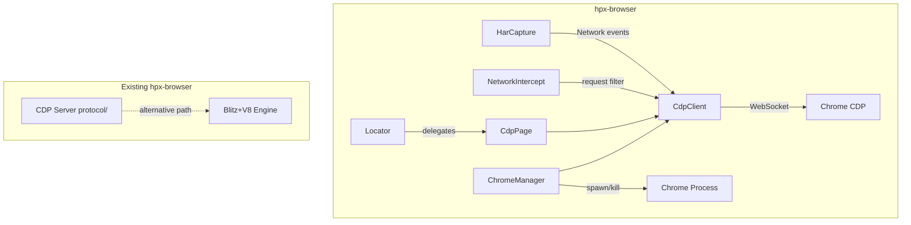
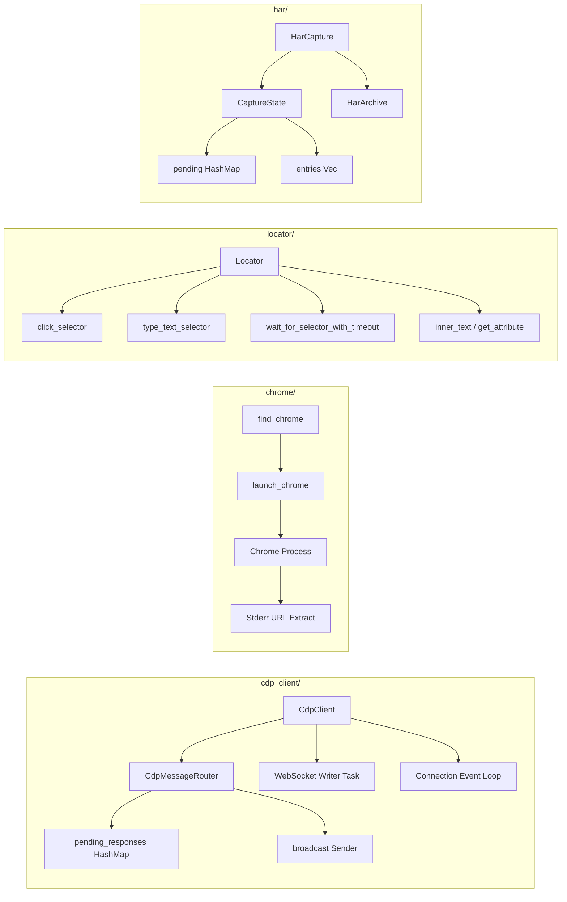

# Design: Absorb ferrous-browser Features into hpx-browser

| Metadata | Details |
| :--- | :--- |
| **Author** | pb-plan agent |
| **Status** | Draft |
| **Created** | 2026-07-07 |
| **Reviewers** | N/A |
| **Related Issues** | N/A |

## 1. Executive Summary

**Problem:** hpx-browser currently has a CDP *server* (for Puppeteer/Playwright to drive hpx-browser) but lacks a CDP *client* (to connect hpx-browser to real Chrome/Chromium instances). It also lacks Chrome process management, a Locator-style API for element interaction, HAR capture, network request interception, and real cookie get/set via CDP. ferrous-browser implements all of these as a pure-Rust async CDP client library with race-free event handling and high-performance patterns.

**Solution:** Absorb ferrous-browser's CDP client, Chrome process management, Locator API, HAR capture, network interception, and cookie operations into hpx-browser as a new feature-gated `cdp-client` module. hpx-browser already has a CDP server (`protocol/`); the new client module complements it by allowing hpx-browser to *drive* real Chrome when the built-in engine is insufficient.

---

## 2. Source Inputs & Normalization

### 2.1 Source Materials

- Full source of `ferrous-browser` at `/Users/akagi201/tmp/ferrous-browser/` (~3,800 lines across 7 source files)
- Full source of hpx-browser at `crates/hpx-browser/` (~8,500 lines across 15+ source files)
- Existing CDP server implementation: `crates/hpx-browser/src/protocol/` (session.rs, server.rs, types.rs)
- User requirement: "深度分析 /Users/akagi201/tmp/ferrous-browser 吸收他的 feature 与实现到当前项目"

### 2.2 Normalization Approach

After deep analysis, ferrous-browser provides six distinct feature groups that map to hpx-browser gaps:

1. **CDP Client** (`cdp.rs`, `connection.rs`) — WebSocket-based CDP message router with atomic ID generation, register-before-send race prevention, broadcast event fan-out, and fail-all-pending on disconnect
2. **Chrome Process Management** (`browser.rs`) — Platform-aware Chrome binary detection, free port allocation, stderr URL extraction (vs HTTP polling), lazy stderr drain, Drop-based cleanup
3. **Page Abstraction with Locator** (`page.rs`) — Typed `evaluate<T>()`, `evaluate_handle()`, Locator API (click, type_text, inner_text, get_attribute), MutationObserver-based wait_for_selector, character-by-character typing via CDP Input events
4. **HAR Capture** (`har.rs`) — Full HTTP Archive 1.2 with pending request tracking, snapshot export, manual ISO 8601 (no chrono dependency)
5. **Network Interception** (`page.rs:intercept_requests`) — Session-scoped request interception with abort/continue callback
6. **Cookie Operations** (`page.rs:cookies/set_cookies`) — CDP-based cookie get/set via Network domain

These map to five implementation modules in hpx-browser, plus enhancements to the existing CDP types.

### 2.3 Source Requirement Ledger

| Requirement ID | Source Summary | Type | Notes |
| :--- | :--- | :--- | :--- |
| `R1` | CDP WebSocket client with atomic message IDs and pending response tracking | Functional | From `cdp.rs` (438 lines) |
| `R2` | Register-before-send pattern to eliminate event subscription races | Functional | Key innovation from `cdp.rs` |
| `R3` | Broadcast-based event fan-out for multi-subscriber patterns | Functional | From `cdp.rs` broadcast::Sender |
| `R4` | Fail-all-pending on WebSocket disconnect (immediate error vs timeout) | Functional | From `cdp.rs` fail_all_pending() |
| `R5` | Dedicated writer task via unbounded mpsc channel | Functional | From `cdp.rs` spawn_writer_task() |
| `R6` | Platform-aware Chrome binary detection (macOS/Linux/Windows) | Functional | From `browser.rs` find_chrome() |
| `R7` | Free port allocation via TcpListener::bind("127.0.0.1:0") | Functional | From `browser.rs` free_port() |
| `R8` | Chrome stderr URL extraction (vs HTTP /json/version polling) | Functional | From `browser.rs` launch_chrome() |
| `R9` | Chrome process lifecycle management with Drop cleanup | Functional | From `browser.rs` Drop impl |
| `R10` | Session ID isolation for multi-page CDP | Functional | From `page.rs` session_id filtering |
| `R11` | Typed JavaScript evaluation with serde deserialization | Functional | From `page.rs` evaluate<T>() |
| `R12` | Remote object handles via evaluate_handle() | Functional | From `page.rs` evaluate_handle() |
| `R13` | Playwright-style Locator API (click, type, wait, text, attribute) | Functional | From `page.rs` Locator struct |
| `R14` | MutationObserver-based wait_for_selector (push-to-Chrome, 1 RTT) | Functional | From `page.rs` wait_for_selector_with_timeout() |
| `R15` | Character-by-character typing via CDP Input.dispatchKeyEvent | Functional | From `page.rs` type_text_selector() |
| `R16` | Full HAR 1.2 capture with pending request tracking | Functional | From `har.rs` (795 lines) |
| `R17` | HAR snapshot export without stopping capture | Functional | From `har.rs` HarCapture::export() |
| `R18` | Network request interception with abort/continue callback | Functional | From `page.rs` intercept_requests() |
| `R19` | CDP-based cookie get/set via Network domain | Functional | From `page.rs` cookies()/set_cookies() |
| `R20` | Multi-page session with correct event filtering | Functional | From `browser.rs` new_page() subscribe-before-send |
| `R21` | OnceCell for lazy one-time Page.enable | Functional | From `page.rs` page_enabled Arc<OnceCell> |
| `R22` | Sync mutex for hot-path pending_responses (no .await while held) | Functional | From `cdp.rs` StdMutex usage |
| `R23` | WaitUntil enum (DomContentLoaded, Load, NetworkIdle) | Functional | From `page.rs` WaitUntil enum |
| `R24` | Screenshot and PDF export via CDP | Functional | From `page.rs` screenshot()/pdf() |
| `R25` | Manual ISO 8601 formatter (no chrono dependency) | Functional | From `har.rs` iso_timestamp() |

---

## 3. Requirements & Goals

### 3.1 Problem Statement

hpx-browser has a CDP *server* (`protocol/` module) that lets Puppeteer/Playwright drive hpx-browser, but no CDP *client* to drive real Chrome. Users who need real Chrome rendering (for complex JS frameworks, WebGL, WebRTC) must use external tools. The CDP server's session handling is basic — it lacks multi-page isolation, race-free event subscription, and the full Chrome process lifecycle that ferrous-browser provides. Additionally, hpx-browser lacks HAR capture, network interception callbacks, a Locator-style element API, and CDP-based cookie operations.

### 3.2 Functional Requirements (EARS)

**Ubiquitous (always true):**

- **[REQ-01]:** The system *shall* provide a `CdpClient` struct that connects to a Chrome DevTools Protocol WebSocket endpoint and routes messages by ID.
- **[REQ-02]:** The system *shall* generate unique message IDs atomically and track pending responses with a register-before-send pattern.
- **[REQ-03]:** The system *shall* broadcast CDP events to multiple subscribers via a Tokio broadcast channel.
- **[REQ-04]:** The system *shall* fail all pending requests immediately when the WebSocket disconnects (not after a 30s timeout).

**State-driven (conditional on state):**

- **[REQ-05]:** While a Chrome process is managed by the system, the system *shall* kill the process on Drop.
- **[REQ-06]:** While multiple pages share a CDP connection, the system *shall* filter events by session ID to prevent cross-page contamination.

**Event-driven (triggered by event):**

- **[REQ-07]:** When a user creates a new page via CDP, the system *shall* subscribe to events before sending the createTarget command (subscribe-before-send).
- **[REQ-08]:** When a user calls `wait_for_selector`, the system *shall* inject a MutationObserver-backed Promise into Chrome and wait for it to resolve (1 RTT, not polling).
- **[REQ-09]:** When a user starts HAR capture, the system *shall* track all Network domain events and build a complete HAR 1.2 archive.
- **[REQ-10]:** When a user starts network interception, the system *shall* invoke a callback for each request allowing abort or continue decisions.

**Unwanted (avoidance):**

- **[REQ-11]:** The system *shall not* introduce any dependency on `chrono` for timestamp formatting.
- **[REQ-12]:** The system *shall not* block the Tokio runtime while holding any mutex (use sync mutex only where no .await follows).

**Exception (conditional exception):**

- **[REQ-13]:** Where Chrome's stderr URL extraction fails, the system *shall* fall back to HTTP `/json/version` polling.

### 3.3 Non-Functional Goals

- **Performance:** CDP message routing should be O(1) via HashMap lookup. Event broadcast should use Tokio broadcast channel (capacity 1024). HAR capture pending request tracking uses HashMap. MutationObserver wait_for_selector achieves ~1ms reaction gap (vs 102ms for polling).
- **Reliability:** WebSocket disconnect fails all pending requests immediately. Chrome process is always cleaned up on Drop. HAR capture flushes pending requests with current timestamp on stop.
- **Security:** No new attack surface — CDP client connects to local Chrome only. HAR capture does not persist sensitive data by default.
- **Memory:** Manual ISO 8601 avoids chrono's ~200K binary overhead. Sync mutex for hot paths avoids tokio mutex overhead.

### 3.4 Out of Scope

- Real-time Chrome DevTools UI rendering (not a browser developer tools replacement)
- Chrome extension support
- WebRTC/PeerConnection automation
- Full CDP protocol coverage (only implement domains needed for core features)
- Chrome profile management (user data directories) — deferred to future work

### 3.5 Assumptions

- hpx-browser's existing CDP server (`protocol/` module) remains unchanged. The new client module is additive.
- ferrous-browser's `tokio-tungstenite` dependency is replaced by hpx-yawc (the workspace's WebSocket library).
- ferrous-browser's `reqwest` dependency for `/json/version` fallback is replaced by hpx core client.
- ferrous-browser's `which` dependency for Chrome detection is acceptable as a new workspace dependency.
- The CDP client module is feature-gated behind `cdp-client` to avoid adding `tokio-tungstenite`/`which` deps to the default build.

### 3.6 Code Simplification Constraints (Ponytail Ladder)

1. **Does this need to exist?** Yes — users need CDP client to drive real Chrome. This is the primary use case.
2. **Stdlib does it?** WebSocket and process management require external crates.
3. **Native platform feature covers it?** Chrome detection requires platform-specific path logic.
4. **Already-installed dependency?** hpx-yawc replaces tokio-tungstenite. hpx replaces reqwest. serde/serde_json/tokio already in workspace.
5. **One line?** No — CDP client is ~1000 lines of non-trivial async code.
6. **Only then:** Port ferrous-browser's patterns with hpx-native dependencies.

**Mark deferrals:**

- `ponytail: Chrome profile management (user data dirs) — add when users request persistent sessions`
- `ponytail: Full CDP protocol coverage — implement domains on-demand as users need them`
- `ponytail: HTTP/3 QUIC for CDP — local connections don't need QUIC`

**Never simplify away:** Register-before-send race prevention, session ID isolation, Drop-based process cleanup, immediate fail-all-pending on disconnect.

**Additional constraints:**

- **Behavior Preservation Boundary:** All existing hpx-browser APIs remain unchanged. New features are additive only. The existing CDP server (`protocol/` module) is not modified.
- **Repo Standards:** Follow AGENTS.md: `scc` over `dashmap`, `thiserror` for library errors, `tracing` for logging, no `unsafe`, clippy::pedantic, `unwrap_used = "deny"`.
- **Readability Priorities:** Named constants for CDP method strings, clear async flow, explicit error propagation.
- **Refactoring Non-Goals:** Do not restructure existing `protocol/` module unless a task explicitly requires it.

---

## 4. Requirements Coverage Matrix

| Requirement ID | EARS Pattern | Covered In Design | Scenario Coverage | Task Coverage | Status / Rationale |
| :--- | :--- | :--- | :--- | :--- | :--- |
| `R1` | Ubiquitous | §6.2 CdpClient | CDP client connect scenario | Task 2.1 | Covered |
| `R2` | Ubiquitous | §6.2 register-before-send | Race-free subscription scenario | Task 2.1 | Covered |
| `R3` | Ubiquitous | §6.2 broadcast events | Multi-subscriber scenario | Task 2.1 | Covered |
| `R4` | Ubiquitous | §6.2 fail_all_pending | Disconnect handling scenario | Task 2.2 | Covered |
| `R5` | Ubiquitous | §6.2 writer task | Concurrent write scenario | Task 2.1 | Covered |
| `R6` | Ubiquitous | §6.3 find_chrome | Chrome detection scenario | Task 3.1 | Covered |
| `R7` | Ubiquitous | §6.3 free_port | Port allocation scenario | Task 3.1 | Covered |
| `R8` | Exception | §6.3 launch_chrome | Chrome launch scenario | Task 3.2 | Covered |
| `R9` | State-driven | §6.3 Drop impl | Process cleanup scenario | Task 3.2 | Covered |
| `R10` | State-driven | §6.2 session isolation | Multi-page scenario | Task 2.3 | Covered |
| `R11` | Ubiquitous | §6.4 evaluate<T> | Typed evaluation scenario | Task 4.1 | Covered |
| `R12` | Ubiquitous | §6.4 evaluate_handle | Remote object scenario | Task 4.1 | Covered |
| `R13` | Ubiquitous | §6.4 Locator | Element interaction scenario | Task 4.2 | Covered |
| `R14` | Event-driven | §6.4 wait_for_selector | MutationObserver scenario | Task 4.3 | Covered |
| `R15` | Event-driven | §6.4 type_text | Character typing scenario | Task 4.2 | Covered |
| `R16` | Event-driven | §6.5 HarCapture | HAR capture scenario | Task 5.1 | Covered |
| `R17` | Event-driven | §6.5 HarCapture::export | HAR snapshot scenario | Task 5.1 | Covered |
| `R18` | Event-driven | §6.4 intercept_requests | Network interception scenario | Task 4.4 | Covered |
| `R19` | Event-driven | §6.4 cookies/set_cookies | Cookie operations scenario | Task 4.5 | Covered |
| `R20` | State-driven | §6.2 + §6.3 multi-page | Multi-page session scenario | Task 2.3, 3.3 | Covered |
| `R21` | Ubiquitous | §6.4 OnceCell | Lazy enable scenario | Task 4.1 | Covered |
| `R22` | Unwanted | §6.2 hot-path mutex | No-await-while-held scenario | Task 2.1 | Covered |
| `R23` | Ubiquitous | §6.4 WaitUntil | Navigation wait scenario | Task 4.1 | Covered |
| `R24` | Ubiquitous | §6.4 screenshot/pdf | Screenshot/PDF scenario | Task 4.6 | Covered |
| `R25` | Unwanted | §6.5 iso_timestamp | No-chrono scenario | Task 5.1 | Covered |

---

## 5. Architecture Overview

### 5.1 System Context (C4 Level 1)

```text
┌─────────────────────────────────────────────────────────────────────┐
│                        User / CLI / Tests                           │
│   hpx-cli browser fetch/scrape • Puppeteer/Playwright • Library    │
└──────────────────────────────┬──────────────────────────────────────┘
                               │
                               ▼
┌─────────────────────────────────────────────────────────────────────┐
│                     hpx-browser crate                               │
│                                                                     │
│  ┌──────────────────┐    ┌──────────────────┐    ┌──────────────┐  │
│  │  CDP Server       │    │  CDP Client (NEW)│    │  Page Engine │  │
│  │  (protocol/)      │    │  (cdp_client/)   │    │  (page.rs)   │  │
│  │  Puppeteer → hpx  │    │  hpx → Chrome    │    │  Blitz+V8    │  │
│  └──────────────────┘    └────────┬─────────┘    └──────────────┘  │
│                                   │                                 │
│  ┌──────────────────┐    ┌───────┴──────────┐    ┌──────────────┐  │
│  │  Chrome Manager   │    │  Locator API     │    │  HAR Capture │  │
│  │  (chrome/)        │    │  (locator.rs)    │    │  (har.rs)    │  │
│  │  detect, launch   │    │  click, type,    │    │  1.2 archive │  │
│  └──────────────────┘    │  wait, text      │    └──────────────┘  │
│                           └──────────────────┘                     │
└──────────────────────────────┬──────────────────────────────────────┘
                               │ WebSocket
                               ▼
                    ┌──────────────────────┐
                    │  Chrome/Chromium     │
                    │  (real browser)      │
                    └──────────────────────┘
```

### 5.2 Container Diagram (C4 Level 2)



### 5.3 Component Diagram (C4 Level 3)



### 5.4 Key Design Principles

- **Register-before-send:** CDP response handlers are registered in `pending_responses` BEFORE the WebSocket write. This eliminates the race where Chrome replies before the handler is registered.
- **Subscribe-before-command:** Event subscriptions are established BEFORE sending the CDP command that triggers the event. Used in `goto()`, `new_page()`, and `intercept_requests()`.
- **Session isolation:** Every CDP message carries a `session_id`. Events are filtered by both method and session_id so concurrent pages never cross-contaminate.
- **Fail-fast on disconnect:** When the WebSocket closes, all in-flight requests are immediately failed (oneshot senders dropped) instead of waiting for timeout.
- **Dedicated writer task:** Outgoing WebSocket writes go through an unbounded mpsc channel to a dedicated task. Callers never contend on the WebSocket sink.
- **Sync mutex for hot paths:** `pending_responses` uses `std::sync::Mutex` (not tokio) because no `.await` happens while holding it.
- **No chrono dependency:** Manual ISO 8601 formatter avoids ~200K binary overhead.

### 5.5 Existing Components to Reuse

| Component | Location | How to Reuse |
| :--- | :--- | :--- |
| `hpx_yawc::WebSocket` | `crates/yawc/src/native/mod.rs` | Replace `tokio-tungstenite` for CDP WebSocket connection |
| `hpx::Client` | `crates/hpx/src/client/http.rs` | Replace `reqwest` for `/json/version` fallback HTTP requests |
| `CdpRequest/CdpResponse/CdpEvent/CdpError` | `crates/hpx-browser/src/protocol/types.rs` | Reuse existing CDP type definitions (extend with session_id) |
| `CdpSession` | `crates/hpx-browser/src/protocol/session.rs` | Reference for CDP method dispatch patterns |
| `Page::from_html()` | `crates/hpx-browser/src/page.rs` | Reference for page construction pattern |
| `scc::HashMap` | workspace dep | Use for pending_responses and HAR pending tracking |
| `tokio::sync::broadcast` | workspace dep | Use for event fan-out |
| `tokio::sync::oneshot` | workspace dep | Use for pending response registration |
| `which` crate | workspace dep | For Chrome binary detection (already in workspace deps) |

### 5.6 Project Identity Alignment

No template identity mismatches detected. The hpx workspace uses project-matching crate names.

### 5.7 Architecture Decision Snapshot Inputs

**Existing decisions to preserve (from AGENTS.md):**

- `scc` over `dashmap` for concurrent maps
- `thiserror` for library errors
- `tracing` only (not `log`)
- No `unsafe`
- `clippy::pedantic` + `clippy::nursery`
- `unwrap_used = "deny"`, `expect_used = "deny"`

### 5.8 SRP / DIP Check

- **SRP Check:** CdpClient (message routing), ChromeManager (process lifecycle), Locator (element interaction), HarCapture (archive building), NetworkInterceptor (request filtering) — five distinct responsibilities, five modules.
- **DIP Check:** CdpClient depends on `WebSocket` trait (hpx-yawc). ChromeManager depends on `Command` (std) for process spawning. Locator depends on CdpClient (abstraction). No circular dependencies.
- **Dependency Injection Plan:** CdpClient accepts a WebSocket connection (already split into sink/stream). ChromeManager accepts a `ChromeConfig` struct. Locator borrows CdpClient reference.

### 5.8a Performance Impact Assessment

| Decision | Performance Characteristic | Risk | Mitigation |
| :--- | :--- | :--- | :--- |
| Sync mutex for pending_responses | O(1) insert/remove, no async overhead | Contention under high message rate | HashMap with atomic ID keys — minimal contention |
| Broadcast channel for events | O(1) fan-out per subscriber | Lost messages if subscriber slow | Capacity 1024, slow subscribers get lagged error |
| MutationObserver wait_for_selector | 1 CDP round-trip, ~1ms reaction | Chrome must be responsive | Timeout wrapper prevents infinite wait |
| HAR pending tracking | O(1) insert/remove per request | Memory growth under heavy load | Flush pending on stop(), bounded by capture duration |

---

## 6. Architecture Decisions

### AD-01: CDP Client as Feature-Gated Module

- **Status:** `Proposed`
- **Date:** 2026-07-07

**Context:**
hpx-browser has a CDP server but no CDP client. Users need to drive real Chrome for complex rendering scenarios. The CDP client adds dependencies (which, hpx-yawc as WebSocket) that not all users need.

**Decision:**
Create `cdp_client/` module behind `cdp-client` feature flag. Default build does not include Chrome process management or CDP client.

**Consequences:**

- Positive: Users who don't need real Chrome get smaller binaries. Feature is opt-in.
- Negative: Two feature flags to manage (`cdp` for server, `cdp-client` for client).
- Neutral: Naming clarification — `cdp` = server (existing), `cdp-client` = client (new).

### AD-02: hpx-yawc as WebSocket Backend

- **Status:** `Proposed`
- **Date:** 2026-07-07

**Context:**
ferrous-browser uses `tokio-tungstenite` for WebSocket. hpx has `hpx-yawc` as the workspace WebSocket library with RFC 6455 compliance and permessage-deflate.

**Decision:**
Use `hpx_yawc::WebSocket` as the WebSocket backend for CDP client connections. Adapt ferrous-browser's connection pattern to work with yawc's API.

**Consequences:**

- Positive: Consistent WebSocket usage across workspace. No new dependency.
- Negative: API differences between tokio-tungstenite and yawc require adaptation. yawc's split model (HttpStream vs raw TCP) adds a layer.
- Neutral: yacw's Frame-based API maps naturally to CDP's text frames.

### AD-03: Manual Chrome Process Management

- **Status:** `Proposed`
- **Date:** 2026-07-07

**Context:**
ferrous-browser has a full Chrome lifecycle: detect → launch → connect → use → kill. This is critical for the CDP client to work without requiring users to manually start Chrome.

**Decision:**
Port ferrous-browser's `find_chrome()`, `free_port()`, `launch_chrome()` into a `chrome/` module. Use `std::process::Command` for spawning, `Drop` for cleanup.

**Consequences:**

- Positive: Zero-config Chrome usage — just call `Browser::launch()`.
- Negative: Platform-specific code paths (macOS/Linux/Windows Chrome paths).
- Neutral: `which` crate already in workspace for binary detection.

### AD-04: Locator API as CdpPage Extension

- **Status:** `Proposed`
- **Date:** 2026-07-07

**Context:**
ferrous-browser has a Playwright-inspired Locator API that wraps CDP commands for element interaction. hpx-browser's existing Page is Blitz-based (no CDP). The Locator needs to work with CDP-connected pages.

**Decision:**
Create `CdpPage` struct (wraps CdpClient + session_id) and `Locator` struct (wraps CdpPage + selector). Locator delegates to CdpPage methods which send CDP commands.

**Consequences:**

- Positive: Clean separation between Blitz-based Page and CDP-based CdpPage.
- Negative: Two page types (Page for Blitz, CdpPage for CDP) — users must choose.
- Neutral: CdpPage can be extended with all CDP domains incrementally.

### AD-05: HAR Capture as Standalone Module

- **Status:** `Proposed`
- **Date:** 2026-07-07

**Context:**
ferrous-browser's HAR capture is 795 lines with its own state machine, pending request tracking, and ISO 8601 formatting. It's tightly coupled to ferrous-browser's CDP client.

**Decision:**
Port HarCapture as a standalone module that accepts a broadcast::Receiver<CDPMessage> for event input. This decouples it from the specific CDP client implementation.

**Consequences:**

- Positive: HAR capture can be used with any CDP event source (server or client).
- Negative: Additional abstraction layer (broadcast receiver) adds slight overhead.
- Neutral: Manual ISO 8601 avoids chrono dependency — aligned with AGENTS.md.

---

## 7. Detailed Design

### 7.1 Module Structure

```text
crates/hpx-browser/src/
├── cdp_client/                          # NEW — CDP client for driving real Chrome
│   ├── mod.rs                           # Crate root, re-exports CdpClient, CdpPage, Browser
│   ├── cdp.rs                           # CDP message types, CdpClient (message router)
│   ├── connection.rs                    # WebSocket lifecycle + message dispatch loop
│   └── error.rs                         # CdpClientError enum (thiserror)
├── chrome/                              # NEW — Chrome process management
│   ├── mod.rs                           # Re-exports Browser, BrowserConfig
│   ├── browser.rs                       # BrowserConfig, Browser (launch/connect/new_page)
│   └── detect.rs                        # find_chrome(), platform-aware binary detection
├── locator.rs                           # NEW — Playwright-style Locator for CdpPage
├── cdp_page.rs                          # NEW — CdpPage (CDP-connected page abstraction)
├── har.rs                               # NEW — Full HAR 1.2 capture system
├── protocol/                            # EXISTING — CDP server (unchanged)
│   ├── mod.rs
│   ├── server.rs
│   ├── session.rs
│   └── types.rs                         # EXTENDED — add session_id field to CdpRequest
└── page.rs                              # EXISTING — Blitz-based Page (unchanged)
```

### 7.2 Data Structures & Types

```rust
// === cdp_client/cdp.rs ===

/// Atomic message ID generator for CDP requests.
struct MessageIdCounter {
    counter: AtomicU32,
}

/// CDP client — core message router.
pub struct CdpClient {
    message_id: Arc<MessageIdCounter>,
    pending_responses: Arc<StdMutex<HashMap<u32, oneshot::Sender<serde_json::Value>>>>,
    event_broadcast: broadcast::Sender<CdpMessage>,
    ws_tx: Arc<StdMutex<Option<mpsc::UnboundedSender<String>>>>,
}

/// Incoming CDP message (response or event).
#[derive(Debug, Clone)]
pub struct CdpMessage {
    pub id: Option<u32>,
    pub method: Option<String>,
    pub params: Option<serde_json::Value>,
    pub result: Option<serde_json::Value>,
    pub error: Option<serde_json::Value>,
    pub session_id: Option<String>,
}

// === cdp_client/error.rs ===

#[derive(Debug, thiserror::Error)]
pub enum CdpClientError {
    #[error("WebSocket error during {operation}: {message}")]
    WebSocket { operation: String, message: String },

    #[error("Connection failed to {endpoint}: {reason}")]
    ConnectionFailed { endpoint: String, reason: String },

    #[error("CDP command {command} failed: {reason}")]
    CommandFailed { command: String, reason: String },

    #[error("CDP error {code} on {method}: {message}")]
    CdpError { code: i32, method: String, message: String },

    #[error("Timeout after {timeout_secs}s waiting for {operation}")]
    Timeout { operation: String, timeout_secs: u64 },

    #[error("Page not found: {0}")]
    PageNotFound(String),

    #[error("Navigation failed to {url}: {reason}")]
    NavigationFailed { url: String, reason: String },

    #[error(transparent)]
    Json(#[from] serde_json::Error),

    #[error(transparent)]
    Io(#[from] std::io::Error),
}

// === chrome/browser.rs ===

#[derive(Debug, Clone)]
pub struct BrowserConfig {
    pub headless: bool,
    pub timeout: Duration,
    pub viewport: (u32, u32),
    pub args: Vec<String>,
}

pub struct Browser {
    cdp: Arc<CdpClient>,
    pages: Arc<RwLock<Vec<CdpPage>>>,
    _child: Option<Child>,
}

// === cdp_page.rs ===

#[derive(Debug, Clone)]
pub enum WaitUntil {
    DomContentLoaded,
    Load,
    NetworkIdle,
}

pub struct CdpPage {
    target_id: String,
    session_id: String,
    cdp: Arc<CdpClient>,
    page_enabled: Arc<OnceCell<()>>,
}

// === locator.rs ===

pub struct Locator {
    selector: String,
    page: CdpPage,
}

impl Locator {
    pub async fn click(&self) -> Result<(), CdpClientError>;
    pub async fn type_text(&self, text: &str) -> Result<(), CdpClientError>;
    pub async fn wait_for(&self, timeout: Duration) -> Result<(), CdpClientError>;
    pub async fn inner_text(&self) -> Result<String, CdpClientError>;
    pub async fn get_attribute(&self, name: &str) -> Result<Option<String>, CdpClientError>;
}

// === har.rs ===

pub struct HarCapture {
    cdp: Arc<CdpClient>,
    session_id: Option<String>,
    state: Arc<Mutex<CaptureState>>,
    shutdown: broadcast::Sender<()>,
}

struct CaptureState {
    pending: HashMap<String, PendingRequest>,
    entries: Vec<HarEntry>,
}

#[derive(Debug, Serialize)]
pub struct HarArchive {
    pub log: HarLog,
}
```

### 7.3 Interface Design

```rust
// === CdpClient API ===

impl CdpClient {
    /// Connect to a CDP WebSocket endpoint.
    pub async fn connect(ws_url: &str) -> Result<Self, CdpClientError>;

    /// Send a CDP command and wait for its response.
    pub async fn send_command(
        &self,
        method: &str,
        params: Option<serde_json::Value>,
    ) -> Result<serde_json::Value, CdpClientError>;

    /// Send a CDP command with session ID.
    pub async fn send_command_with_session(
        &self,
        method: &str,
        params: Option<serde_json::Value>,
        session_id: &str,
    ) -> Result<serde_json::Value, CdpClientError>;

    /// Subscribe to CDP events. Returns a broadcast receiver.
    pub fn subscribe_events(&self) -> broadcast::Receiver<CdpMessage>;

    /// Subscribe to events filtered by method and session ID.
    pub fn subscribe_events_filtered(
        &self,
        method: &str,
        session_id: Option<&str>,
    ) -> broadcast::Receiver<CdpMessage>;
}

// === Browser API ===

impl Browser {
    /// Launch a new Chrome instance and connect via CDP.
    pub async fn launch(config: BrowserConfig) -> Result<Self, CdpClientError>;

    /// Connect to an existing Chrome instance.
    pub async fn connect(ws_url: &str) -> Result<Self, CdpClientError>;

    /// Create a new page (tab).
    pub async fn new_page(&self) -> Result<CdpPage, CdpClientError>;

    /// Get all open pages.
    pub fn pages(&self) -> Vec<CdpPage>;
}

// === CdpPage API ===

impl CdpPage {
    /// Navigate to a URL with wait strategy.
    pub async fn goto(
        &self,
        url: &str,
        wait_until: WaitUntil,
    ) -> Result<(), CdpClientError>;

    /// Evaluate JavaScript and return typed result.
    pub async fn evaluate<T: DeserializeOwned>(
        &self,
        expression: &str,
    ) -> Result<T, CdpClientError>;

    /// Get page content (outerHTML).
    pub async fn content(&self) -> Result<String, CdpClientError>;

    /// Get page title.
    pub async fn title(&self) -> Result<String, CdpClientError>;

    /// Take a screenshot (returns PNG bytes).
    pub async fn screenshot(&self) -> Result<Vec<u8>, CdpClientError>;

    /// Export page as PDF.
    pub async fn pdf(&self) -> Result<Vec<u8>, CdpClientError>;

    /// Get a Locator for a CSS selector.
    pub fn locator(&self, selector: &str) -> Locator;

    /// Wait for a CSS selector to appear.
    pub async fn wait_for_selector(
        &self,
        selector: &str,
        timeout: Duration,
    ) -> Result<(), CdpClientError>;

    /// Start HAR capture for this page.
    pub async fn start_har_capture(&self) -> Result<HarCapture, CdpClientError>;

    /// Start network request interception.
    pub async fn intercept_requests<F>(
        &self,
        callback: F,
    ) -> Result<(), CdpClientError>
    where
        F: Fn(String, String) -> bool + Send + Sync + 'static;

    /// Get cookies for this page.
    pub async fn cookies(&self) -> Result<Vec<serde_json::Value>, CdpClientError>;

    /// Set cookies for this page.
    pub async fn set_cookies(
        &self,
        cookies: &[serde_json::Value],
    ) -> Result<(), CdpClientError>;
}
```

### 7.4 Logic Flow

**CDP Client Message Flow:**

```text
User Code → CdpClient::send_command()
  → Generate atomic ID
  → Register oneshot::channel in pending_responses (SYNC, no .await)
  → Send JSON string via mpsc channel to writer task
  → Writer task writes to WebSocket sink
  → Connection event loop reads WebSocket stream
  → Parse JSON → CdpMessage
  → If message.id matches pending → complete oneshot
  → If message is event → broadcast to all subscribers
```

**Chrome Launch Flow:**

```text
Browser::launch(config)
  → find_chrome() — platform-specific path search
  → free_port() — TcpListener::bind("127.0.0.1:0")
  → spawn Chrome with --remote-debugging-port={port}
  → parse stderr for "DevTools listening on ws://..."
  → CdpClient::connect(ws_url)
  → send Target.setAutoAttach
  → return Browser handle
```

**Page Creation Flow (Race-Free):**

```text
Browser::new_page()
  → subscribe to Target.attachedToTarget events
  → send Target.createTarget
  → wait for event matching new targetId
  → extract sessionId from event params
  → create CdpPage with target_id + session_id
```

**MutationObserver wait_for_selector Flow:**

```text
CdpPage::wait_for_selector(selector, timeout)
  → inject MutationObserver + Promise into Chrome via Runtime.evaluate
  → Chrome holds CDP response open until:
    - Element appears → Promise resolves → CdpClient receives result
    - Timeout fires → Promise rejects → CdpClient receives timeout error
  → One CDP round-trip total (~1ms reaction gap)
```

### 7.5 Configuration

New feature flag:

- `cdp-client` — enables CDP client, Chrome process management, Locator, HAR capture, network interception

Feature composition:

```toml
[features]
default = ["cdp"]
cdp = []                    # existing CDP server
cdp-client = ["dep:which"]  # new CDP client + Chrome management
```

`BrowserConfig` defaults:

```rust
impl Default for BrowserConfig {
    fn default() -> Self {
        Self {
            headless: true,
            timeout: Duration::from_secs(30),
            viewport: (1280, 720),
            args: vec![],
        }
    }
}
```

### 7.6 Error Handling

- `CdpClientError` enum (thiserror): WebSocket, ConnectionFailed, CommandFailed, CdpError, Timeout, PageNotFound, NavigationFailed, Json, Io
- Constructor methods: `websocket()`, `connection_failed()`, `command_failed()`, `timeout()`, `navigation_failed()`
- All CDP commands wrapped in timeout with cleanup on timeout (removes pending handler)
- WebSocket termination fails all pending requests immediately

### 7.7 Maintainability Notes

- CDP method strings as `const &str` at module top (not buried in match arms)
- Named constants for Chrome flags (`--headless=new`, `--no-sandbox`, etc.)
- Manual ISO 8601 with Howard Hinnant's algorithm in har.rs (avoids chrono)
- Locator delegates to CdpPage — single responsibility
- HarCapture accepts broadcast::Receiver — decoupled from CDP client specifics

---

## 8. Verification & Testing Strategy

### 8.1 Unit Testing

| Module | What to Test | Scope |
| :--- | :--- | :--- |
| `cdp_client/cdp.rs` | CdpClient ID generation, message serialization/deserialization | 10+ tests |
| `cdp_client/cdp.rs` | Register-before-send pattern (mock WebSocket) | Race condition test |
| `cdp_client/error.rs` | Error display messages, ResultExt context | 5+ tests |
| `chrome/detect.rs` | find_chrome() on current platform, fallback paths | Platform-specific |
| `chrome/browser.rs` | BrowserConfig defaults/custom, free_port | 5+ tests |
| `locator.rs` | Selector escaping, click/type delegation | Mock CDP |
| `har.rs` | HarCapture pending tracking, archive serialization | 10+ tests |
| `har.rs` | Manual ISO 8601 correctness | Timestamp tests |
| `cdp_page.rs` | WaitUntil default, session_id filtering | 5+ tests |

### 8.2 Property Testing

| Target Behavior | Why Property Testing Helps | Tool / Command | Planned Invariants |
| :--- | :--- | :--- | :--- |
| CDP message JSON serialization | Arbitrary JSON payloads from Chrome | `proptest` | Round-trip: serialize → parse yields same fields |
| HAR entry serialization | Complex nested structures | `proptest` | Serialize never panics on any valid HarEntry |
| ISO 8601 formatting | Edge case timestamps | `proptest` | Output always matches expected format |

### 8.3 Integration Testing

- Chrome connect + new page + navigate + get content (requires Chrome)
- CDP client → CDP server loopback (hpx-browser drives itself)
- HAR capture across page navigation
- Network interception callback abort/continue
- Cookie get/set round-trip

### 8.4 BDD Acceptance Testing

| Scenario ID | Feature File | Command | Success Criteria |
| :--- | :--- | :--- | :--- |
| **BDD-01** | `features/cdp-client.feature` | `cargo test -p hpx-browser --features cdp-client` | CdpClient connects, sends command, receives response |
| **BDD-02** | `features/chrome-management.feature` | `cargo test -p hpx-browser --features cdp-client` | Chrome launches, new_page works, process cleaned up |
| **BDD-03** | `features/locator.feature` | `cargo test -p hpx-browser --features cdp-client` | Locator click/type/wait work against Chrome |
| **BDD-04** | `features/har-capture.feature` | `cargo test -p hpx-browser --features cdp-client` | HAR archive contains correct entries |
| **BDD-05** | `features/network-intercept.feature` | `cargo test -p hpx-browser --features cdp-client` | Interception callback can abort/continue requests |

### 8.5 Robustness & Performance Testing

| Test Type | When It Is Required | Tool / Command | Planned Coverage or Reason Not Needed |
| :--- | :--- | :--- | :--- |
| **Fuzz** | CDP message JSON parsing (untrusted from Chrome) | `cargo fuzz run cdp_parser` | Crash-safety for malformed CDP responses |
| **Benchmark** | CDP message routing throughput | `criterion` | Regression budget: <10us per message |
| **Benchmark** | HAR capture overhead per request | `criterion` | Must not slow network requests by >5% |

### 8.6 Critical Path Verification

| Verification Step | Command | Success Criteria |
| :--- | :--- | :--- |
| **VP-01** | `cargo check -p hpx-browser --features cdp-client` | Compiles with cdp-client feature |
| **VP-02** | `cargo test -p hpx-browser --features cdp-client` | All unit tests pass |
| **VP-03** | `cargo clippy -p hpx-browser --features cdp-client -- -D warnings` | No warnings |
| **VP-04** | `cargo test -p hpx-browser` | Existing tests still pass |
| **VP-05** | `just lint && just test` | Full workspace passes |

### 8.7 Validation Rules

| Test Case ID | EARS Requirement | Action | Expected Outcome | Verification Method |
| :--- | :--- | :--- | :--- | :--- |
| **TC-01** | REQ-01 | Create CdpClient, connect to Chrome | Connection succeeds, messages route correctly | Unit test with mock WebSocket |
| **TC-02** | REQ-02 | Send command before response arrives | Response received, no race condition | Timing test with controlled latency |
| **TC-03** | REQ-04 | Drop CdpClient while commands pending | All pending receive error immediately | Unit test verifying oneshot completion |
| **TC-04** | REQ-05 | Drop Browser while Chrome running | Chrome process killed | Process existence check |
| **TC-05** | REQ-08 | wait_for_selector with MutationObserver | Element found in 1 CDP round-trip | Timing measurement |
| **TC-06** | REQ-09 | Start HAR capture, make request | HAR entry contains request/response | Serialization check |
| **TC-07** | REQ-11 | Compile without chrono | No chrono dependency in binary | `cargo tree` check |

---

## 9. Implementation Plan

- [ ] **Phase 1: Foundation** — Create `cdp_client/`, `chrome/` modules, add feature flags, Cargo.toml deps (which, hpx-yawc)
- [ ] **Phase 2: CDP Client Core** — Port CdpClient message router, register-before-send, broadcast events, writer task, fail-all-pending
- [ ] **Phase 3: Chrome Management** — Port find_chrome(), free_port(), launch_chrome(), Drop cleanup, stderr URL extraction
- [ ] **Phase 4: CdpPage & Locator** — Port CdpPage with goto/evaluate/content/screenshot/pdf, Locator API, MutationObserver wait
- [ ] **Phase 5: HAR & Interception** — Port HarCapture, network interception, cookie operations, manual ISO 8601
- [ ] **Phase 6: Integration & Polish** — Wire into hpx-cli browser commands, BDD tests, benchmarks, documentation
