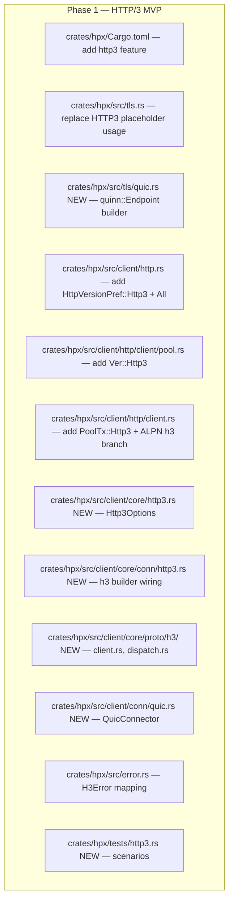
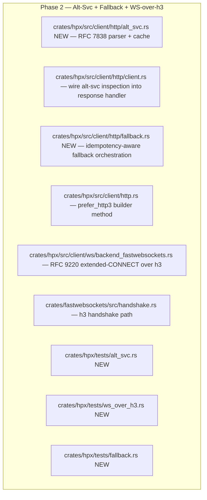
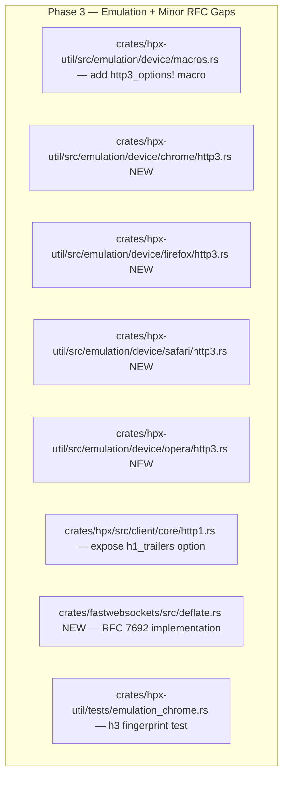
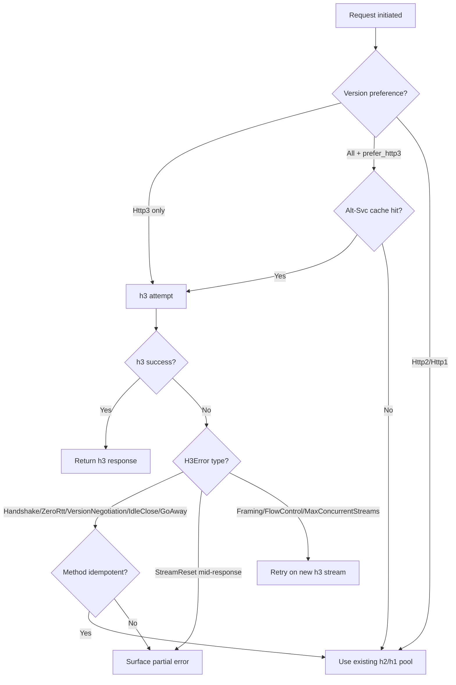

# Design: HTTP/3 Transport + RFC Gap Closure

| Metadata | Details |
| :--- | :--- |
| **Status** | Draft |
| **Created** | 2026-07-19 |
| **Scope** | Full |
| **Feature Name** | `http3-rfc-gap-closure` |
| **Spec Dir** | `specs/2026-07-19-01-http3-rfc-gap-closure/` |
| **Supersedes** | `docs/tasks.md` Phase 1 Task 1 (sub-tasks 1.1–1.5); `docs/adr/0001-http3-over-rustls-quinn.md` records the TLS backend decision referenced there. |
| **Reference repo** | `/Volumes/akext/tmp/reqwest` (reqwest 0.13.4) — comparison baseline only; no code is copied. |

## Summary

hpx already ships a mature HTTP/2 implementation that exceeds reqwest's surface (full RFC 7540 priority tree, customizable SETTINGS order, GREASE, browser-emulation profiles for Chrome v100–v143 / Firefox / Safari / Opera / OkHttp, ECH grease via BoringSSL). HTTP/3 is, however, **not implemented in any usable form** — only the ALPN/ALPS constant placeholders `AlpnProtocol::HTTP3` / `AlpsProtocol::HTTP3` exist (`crates/hpx/src/tls.rs`), with no `quinn` / `h3` / `h3-quinn` dependency, no `Ver::Http3` pool shard, no QUIC TLS path, and no `http3_*` builder methods. WebSocket is split across two backends (fastwebsockets: RFC 6455 + RFC 8441 over h2; yawc: RFC 6455 + RFC 7692 deflate over h1) — RFC 9220 (WebSocket over HTTP/3) is missing entirely.

This spec closes those gaps in three phases:

1. **Phase 1 — HTTP/3 MVP**: end-to-end QUIC + h3 transport, `Ver::Http3` pool shard, `Http3Options`, `http3_only()` / `http3_prior_knowledge()` / `http3_options()` builder methods, typed error surface, ALPN `"h3"` over QUIC. Uses **Option C** from `docs/tasks.md` §1.1: keep BoringSSL as the default backend for h1/h2 (preserving JA3/JA4 fingerprint fidelity) and use rustls+quinn for HTTP/3 (the canonical Rust QUIC stack).
2. **Phase 2 — Alt-Svc discovery + automatic fallback + RFC 9220**: RFC 7838 `Alt-Svc` header parser and per-origin cache, opportunistic h3 upgrade via `prefer_http3()`, h3→h2→h1 fallback respecting method idempotency, and WebSocket-over-h3 (RFC 9220) in the fastwebsockets backend by mirroring the existing RFC 8441 extended-CONNECT path.
3. **Phase 3 — Browser emulation + minor RFC gap closure**: `http3_options!()` macro and per-version Chrome (96+) / Firefox (88+) / Safari (14+) / Opera (78+) QUIC transport-parameter and h3-SETTINGS profiles; expose `h1_trailers` option (the internal `allow_trailer_fields` flag already exists at `crates/hpx/src/client/core/proto/h1/conn.rs:67`); close the fastwebsockets RFC 7692 `permessage-deflate` gap so both backends are feature-equivalent.

HTTP/2 (R1) is treated as a **verification task**, not a rewrite — the existing implementation is already a superset of reqwest's. The verification scenario in `features/http3_transport.feature` (Scenario: HTTP/2 path is unaffected by http3 feature flag) guards against regression.

---

## Requirements & Goals

### Functional Requirements (EARS Notation)

Each requirement uses EARS patterns (Ubiquitous / State-driven / Event-driven / Unwanted / Exception). Derived requirements (D1–D32) from the abduction pass are folded in here under their parent R-IDs.

- **[REQ-01] (R1, verification)** The system *shall* continue to negotiate HTTP/2 via `h2_builder.handshake(io)` followed by spawning the connection dispatcher at `crates/hpx/src/client/core/conn/http2.rs` when ALPN selects `h2`, and the existing `Http2Options` surface *shall* remain backwards-compatible, when the `http3` Cargo feature is enabled or disabled.
- **[REQ-02] (R2, R3, R25, architecture)** The system *shall* implement HTTP/3 transport over QUIC using `quinn` (≥0.11.1), `h3` (≥0.0.8), and `h3-quinn` (≥0.0.10), gated by an optional `http3` Cargo feature that also enables `rustls-tls` and the `rustls/quic` feature.
- **[REQ-03] (R4)** The `http3` Cargo feature *shall* be opt-in and *shall* enable `dep:quinn`, `dep:h3`, `dep:h3-quinn`, and the existing `rustls-tls` feature; it *shall not* enable `boring` and *shall not* disable `boring` if the user has it enabled.
- **[REQ-04] (R5)** The `HttpVersionPref` enum *shall* include an `Http3` variant and an `All` variant that proposes `["h3", "h2", "http/1.1"]` over the appropriate transports; the internal `Ver` enum *shall* include an `Http3` variant alongside `Auto` / `Http2`.
- **[REQ-05] (R6, R24, D2, D12, D13, D14)** The system *shall* parse RFC 7838 `Alt-Svc` response headers received on h1/h2 connections, cache the discovered h3 endpoint keyed by origin (scheme + host + port), honour the `ma=` max-age parameter, honour `Alt-Svc: clear` to purge the cache, ignore malformed entries without crashing the connection, deprioritize unreachable entries after a connection failure, and prefer QUIC for subsequent requests to that origin.
- **[REQ-06] (R7, architecture)** The QUIC connector *shall* implement `tower::Service<ConnectRequest>` — the existing connector abstraction used by `HttpConnector` and `TlsConnector` — and *shall* encapsulate a `quinn::Connection` driving an `h3::client::Connection` via `h3_quinn::Connection`.
- **[REQ-07] (R8, P2)** The `crates/hpx/src/client/http/client/pool.rs` pool *shall* add a `Ver::Http3` shard that reuses a single `quinn::Connection` per authority (multi-stream multiplexing) and *shall* surface validity via a `close_rx` channel fed by a spawned `driver.poll_close` task, mirroring the existing `Ver::Http2` `Shared` reservation semantics.
- **[REQ-08] (R9)** The `hpx-util` emulation module *shall* expose an `http3_options!()` macro and per-version `Http3Options` profiles for Chrome 96+ / Chrome 143+, Firefox 88+, Safari 14+ (macOS 11+), and Opera 78+ (Chromium-following), configuring QUIC transport parameters (initial_max_data, initial_max_stream_data_bidi_local, max_idle_timeout, active_connection_id_limit) and h3 SETTINGS (QPACK_MAX_TABLE_CAPACITY, MAX_FIELD_SECTION_SIZE).
- **[REQ-09] (R10)** `ClientBuilder` *shall* expose `.http3_only()` (force HTTP/3 via `HttpVersionPref::Http3`), `.http3_prior_knowledge()` (alias of `.http3_only()` for reqwest API familiarity), `.http3_options(impl Into<Http3Options>)` (configure QUIC + h3 parameters), `.prefer_http3()` (opportunistic h3 upgrade via Alt-Svc with automatic fallback), and `.quic_config(QuicConfig)` (custom QUIC transport configuration).
- **[REQ-10] (R11, D1, D3, D4, D5, D6, D7, D8, D9, D10, D11, D15, D16)** The system *shall* define a typed `H3Error` enum covering at minimum: `Handshake { source: quinn::ConnectionError }`, `Framing { source: h3::Error }`, `StreamReset { code: u64, stream_id: u64 }`, `IdleClose`, `ZeroRttRejected`, `MigrationFailed`, `VersionNegotiationFailed`, `FlowControl`, `MaxConcurrentStreamsExceeded`, `GoAwayDrained`, `AltSvcUnreachable`, and the system *shall* map these to the existing `crate::error::Kind` so callers can use `Error::is_connect()`, `is_request()`, `is_body()` unchanged.
- **[REQ-11] (R12, D17, D20, D21, D22, D25)** The WebSocket layer *shall* remain compliant with RFC 6455: handle upgrade rejection (non-101) by surfacing the response, fail connection with close code 1002 on malformed frames, enforce Ping/Pong timeouts per §5.5.2, exchange close codes 1000–1011/1015 per §7.4, and surface 1009 Close on oversized messages per §10.4.
- **[REQ-12] (R13, D19)** The fastwebsockets backend *shall* implement RFC 7692 `permessage-deflate` (closing the existing gap documented at `crates/fastwebsockets/src/lib.rs:75`), including negotiation of `server_no_context_takeover` / `client_no_context_takeover` / `server_max_window_bits` / `client_max_window_bits`, with graceful fallback to no compression when no overlap exists.
- **[REQ-13] (R14, D23)** The fastwebsockets backend *shall* retain its existing RFC 8441 WebSocket-over-h2 support (extended CONNECT via `:protocol = websocket`), and *shall* surface a typed error when the server rejects the CONNECT method.
- **[REQ-14] (R15, D18, D24)** The fastwebsockets backend *shall* implement RFC 9220 WebSocket-over-h3 via the extended-CONNECT mechanism over an h3 stream (`:protocol = websocket`, `:method = CONNECT`), and *shall* surface a typed error when the server rejects extended CONNECT.
- **[REQ-15] (R16, D26, D27, D28, D29, D30, D31)** The HTTP/1 parser *shall* handle trailer headers gracefully (skip or surface, never crash), chain `1xx` informational responses (100, 102, 103) and deliver the final response, handle `Expect: 100-continue` timeouts, detect malformed chunked transfer-encoding (bad chunk size, missing CRLF, premature EOF) as a typed error, distinguish HTTP/1.0 vs 1.1 semantics, and reject request-smuggling attempts (ambiguous `Content-Length`, duplicate `Transfer-Encoding`) per RFC 9112 §6.3.
- **[REQ-16] (R19, D15)** When HTTP/3 is unavailable or fails mid-request, the system *shall* automatically fall back to HTTP/2 (and, if needed, HTTP/1.1) for idempotent methods (GET, HEAD, PUT, DELETE, OPTIONS); non-idempotent requests (POST, PATCH, CONNECT) *shall* surface the original HTTP/3 error without retry.
- **[REQ-17] (R21, downgraded)** The system *may* use DNS SRV records as an optional optimization for QUIC endpoint discovery, but *shall* use RFC 7838 Alt-Svc as the canonical discovery mechanism and *shall* default to port 443 when neither Alt-Svc nor SRV provides an endpoint.
- **[REQ-18] (R22)** The existing HTTP/2 ALPN negotiation path at `crates/hpx/src/client/http/client.rs:521-546` (h2_builder handshake + dispatcher spawn) *shall* remain unchanged when `http3` is disabled, and *shall* remain the default HTTP/2 path when `http3` is enabled.
- **[REQ-19] (R23)** The `AlpnProtocol::HTTP3` constant at `crates/hpx/src/tls.rs` *shall* be used as the actual QUIC ALPN token (`b"h3"`) during QUIC handshake, replacing its current placeholder-only status.
- **[REQ-20] (R20)** Total implementation *shall* target ~60–80 tasks across 3 phases (Phase 1: ~25–30, Phase 2: ~20–25, Phase 3: ~15–25), revising the user's initial 80–120 estimate downward after the codebase audit confirmed the existing h2/WS/pool infrastructure can be directly reused.

### Quality Status

- **PASS** (14): R4, R5, R6, R8, R10, R13, R14, R15, R18, R19, R20, R21 (downgraded), R22, R23
- **REWRITTEN** (4): R9 (added Firefox/Safari/Opera), R11 (enumerated error categories), R16 (enumerated HTTP/1 gaps), R17 (specified comparison dimensions)
- **FLAGGED → resolved by codebase audit** (7): R1 (HTTP/2 verified as mature — see §Existing Components to Reuse), R2 (quinn version pinned ≥0.11.1), R3 (h3 ≥0.0.8 / h3-quinn ≥0.0.10), R7 (tower::Service confirmed as the existing abstraction), R12 (RFC 6455 already implemented in both backends — verification only), R21 (DNS SRV downgraded to optional), D32 (HTTP/1 pipelining — explicit non-goal, see NG11)

### Assumptions

| ID | Assumption | Risk if False |
| :--- | :--- | :--- |
| A1 | `quinn` 0.11+ API is stable across patch releases. | Low — 0.11 is the current stable line. |
| A2 | `h3` ≥0.0.8 and `h3-quinn` ≥0.0.10 are stable enough for production use. | **High** — 0.0.x is pre-stable; pin and monitor. ADR-0001 records this risk. |
| A3 | The `rustls-tls` Cargo feature already exists in `crates/hpx/Cargo.toml` (used by the existing rustls backend). | Verified TRUE by audit — `rustls = 0.23.36` is a workspace dep. |
| A4 | The existing `pool.rs` sharding by `Ver` extends cleanly to `Ver::Http3`. | Verified TRUE — `Ver` is a `#[repr(u8)]` enum with `Auto`/`Http2`, adding `Http3` is a non-breaking change. |
| A5 | The existing connector layer uses `tower::Service<ConnectRequest>`. | Verified TRUE — `HttpConnector` and `TlsConnector` both implement it. |
| A6 | The `hpx-util` emulation macro system is extensible to `http3_options!()`. | Verified TRUE — `mod_generator!` macro takes a `$http2_options` parameter; an analogous `$http3_options` parameter is straightforward. |
| A7 | reqwest at `/Volumes/akext/tmp/reqwest` is version 0.13.4. | Verified TRUE. |
| A8 | Chrome 96 (Nov 2021) is correctly identified as the first stable Chrome with HTTP/3. | Low — well-documented. |
| A9 | The existing HTTP/2 implementation is, as the user asserts, "complete and mature". | Verified TRUE — superset of reqwest's h2 surface. |
| A10 | The runtime (tokio 1.49) supports `AsyncUdpSocket` for quinn. | Verified TRUE — tokio 1.x supports it. |
| A11 | A UDP transport abstraction is available; quinn brings its own via `tokio::net::UdpSocket`. | Verified TRUE — no custom UDP layer needed; quinn uses tokio's `UdpSocket` directly. |
| A12 | The existing `Ver` / `HttpVersionPref` enums are the canonical version-routing types. | Verified TRUE — no duplication elsewhere. |
| A13 | Firefox 88+ / Safari 14+ / Opera 78+ are the HTTP/3 enablement versions. | Low — well-documented. |
| A14 | The workspace strict lint posture (deny `unwrap_used`, `expect_used`, `panic`, `todo`, `unimplemented`) applies to all new code. | Verified TRUE — must use `?` / `Result` / explicit error types throughout. |

### Non-Goals

| ID | Non-Goal |
| :--- | :--- |
| NG1 | Implementing a new TLS library from scratch (use rustls via quinn). |
| NG2 | Implementing QUIC from scratch (use quinn). |
| NG3 | Implementing HTTP/3 framing from scratch (use `h3` + `h3-quinn`). |
| NG4 | Supporting HTTP/3 over non-UDP transports (QUIC requires UDP). |
| NG5 | Implementing browser emulation for browsers not already in `hpx-util` (Chrome/Firefox/Safari/Opera/OkHttp). |
| NG6 | Replacing the existing HTTP/1 or HTTP/2 stacks (REQ-01 is verification only). |
| NG7 | Implementing HTTP/0.9 or HTTP/1.0-only features beyond what HTTP/1.1 semantics require. |
| NG8 | Building a custom DNS resolver (DNS SRV, if pursued, uses existing `crates/hpx/src/dns/` resolver). |
| NG9 | Supporting QUIC NAT traversal or hole-punching beyond what quinn provides out of the box. |
| NG10 | Implementing HTTP/2 server push (client-side only; `enable_push` is already exposed for fingerprint compatibility). |
| NG11 | Implementing HTTP/1.1 pipelining (modern clients do not pipeline; existing code already disables it). |
| NG12 | Implementing HTTP caching (RFC 7234 / RFC 9211 Cache-Status) — out of scope for this spec. |
| NG13 | Implementing ECH (Encrypted ClientHello) for QUIC — rustls 0.23 supports it but the existing rustls backend has ECH grease as a no-op; closing that gap is deferred. |
| NG14 | Replacing the yawc backend or merging it with fastwebsockets — both backends remain, with feature parity as the target. |
| NG15 | Implementing the `:authority`/push-promise machinery for HTTP/2 server push (NG10 restated for h2). |

---

## Architecture Overview

### High-Level Architecture (Phase 1+2+3)

```mermaid
flowchart LR
    subgraph Client["ClientBuilder (crates/hpx/src/client/http.rs)"]
        B1[http1_only / http1_options]
        B2[http2_only / http2_options]
        B3[http3_only / http3_prior_knowledge / http3_options / prefer_http3 / quic_config]
    end

    subgraph VersionRouting["Version Routing (client/http/client.rs)"]
        V1[HttpVersionPref::Http1]
        V2[HttpVersionPref::Http2]
        V3[HttpVersionPref::Http3]
        V4[HttpVersionPref::All]
    end

    subgraph Pool["Pool (client/http/client/pool.rs) — 16 shards"]
        P1[Ver::Auto — h1 Unique]
        P2[Ver::Http2 — h2 Shared]
        P3[Ver::Http3 — h3 Shared NEW]
    end

    subgraph Proto["Protocol Layer (client/core/proto/)"]
        H1[h1/ — existing]
        H2[h2/ — existing]
        H3[h3/ — NEW client.rs, dispatch.rs]
    end

    subgraph TLS["TLS Layer (crates/hpx/src/tls/)"]
        T1[boring.rs — h1/h2 JA3/JA4]
        T2[rustls.rs — h1/h2 fallback]
        T3[quic.rs — NEW rustls+quinn for h3]
    end

    subgraph AltSvc["Alt-Svc Cache (client/http/alt_svc.rs) NEW"]
        A1[Parser — RFC 7838]
        A2[Per-origin cache with ma= expiry]
        A3[Unreachable-entry deprioritization]
    end

    subgraph WS["WebSocket (client/ws/)"]
        W1[backend_fastwebsockets.rs — RFC 6455 + 8441 + 9220 NEW + 7692 NEW]
        W2[backend_yawc.rs — RFC 6455 + 7692]
    end

    subgraph Emulation["hpx-util emulation (crates/hpx-util/src/emulation/device/)"]
        E1[chrome/ — tls.rs + http2.rs + http3.rs NEW]
        E2[firefox/ — tls.rs + http2.rs + http3.rs NEW]
        E3[safari/ — tls.rs + http2.rs + http3.rs NEW]
        E4[opera/ — tls.rs + http2.rs + http3.rs NEW]
    end

    Client --> VersionRouting
    VersionRouting --> Pool
    Pool --> Proto
    Proto --> TLS
    Proto -.-> AltSvc
    AltSvc --> Pool
    WS --> Proto
    Emulation --> TLS
    Emulation --> Proto
```



### Phase 1 Component Map



### Phase 2 Component Map



### Phase 3 Component Map



---

## Detailed Design

### 5.1 HTTP/3 Transport (Phase 1)

#### 5.1.1 Dependencies & Feature Flag

**File**: `crates/hpx/Cargo.toml`

Add to `[features]`:

```toml
http3 = ["dep:quinn", "dep:h3", "dep:h3-quinn", "rustls-tls"]
```

Add to `[dependencies]`:

```toml
quinn = { workspace = true, optional = true, default-features = false, features = ["runtime-tokio", "rustls-ring"] }
h3 = { workspace = true, optional = true }
h3-quinn = { workspace = true, optional = true }
```

Add to root `Cargo.toml` `[workspace.dependencies]`:

```toml
quinn = { version = "0.11", default-features = false }
h3 = "0.0.8"
h3-quinn = "0.0.10"
```

Ensure the existing `rustls` workspace dep enables the `quic` feature when `http3` is on. Use a `rustls-tls-quic` internal feature if needed:

```toml
# crates/hpx/Cargo.toml
rustls-tls-quic = ["rustls-tls", "rustls/quic", "tokio-rustls?/quic"]
http3 = ["dep:quinn", "dep:h3", "dep:h3-quinn", "rustls-tls-quic"]
```

**Ponytail check**: reuses existing `rustls-tls` feature; no new TLS provider introduced; quinn's `rustls-ring` matches the existing rustls crypto provider convention.

#### 5.1.2 Version Enum Extension

**File**: `crates/hpx/src/client/http.rs`

```rust
#[repr(u8)]
pub enum HttpVersionPref {
    Http1,
    Http2,
    Http3,   // NEW
    All,     // EXTENDED — now proposes ["h3", "h2", "http/1.1"]
}
```

The `All` ALPN list for TCP TLS becomes `["h2", "http/1.1"]` (h3 is QUIC-only — never proposed over TCP, matching reqwest behaviour at `src/async_impl/client.rs:833-836`). Alt-Svc is the only h3 discovery mechanism over TCP responses.

**File**: `crates/hpx/src/client/http/client/pool.rs`

```rust
#[derive(Clone, Copy, Debug, PartialEq, Eq, Hash)]
#[repr(u8)]
pub enum Ver {
    Auto,
    Http2,
    Http3,   // NEW
}
```

`Ver::Http3` uses `Shared` reservation semantics (one connection serves many streams), mirroring `Ver::Http2`.

#### 5.1.3 Http3Options

**File**: `crates/hpx/src/client/core/http3.rs` (NEW)

Mirrors the structure of `Http2Options` at `crates/hpx/src/client/core/http2.rs`:

```rust
#[derive(Clone, Debug)]
pub struct Http3Options {
    // QUIC transport parameters (mapped to quinn::TransportConfig)
    pub max_idle_timeout: Option<Duration>,
    pub stream_receive_window: Option<u64>,
    pub conn_receive_window: Option<u64>,
    pub send_window: Option<u64>,
    pub congestion_bbr: bool,                 // false → CUBIC (quinn default)
    pub max_concurrent_bidi_streams: Option<u64>,
    pub max_concurrent_uni_streams: Option<u64>,
    pub initial_max_data: Option<u64>,
    pub initial_max_stream_data_bidi_local: Option<u64>,
    pub initial_max_stream_data_bidi_remote: Option<u64>,
    pub initial_max_stream_data_uni: Option<u64>,
    pub active_connection_id_limit: Option<u64>,
    pub enable_0rtt: bool,                     // maps to rustls::ClientConfig::enable_early_data

    // h3 protocol parameters (mapped to h3::client::builder)
    pub max_field_section_size: Option<u64>,   // RFC 9114 §4.2.2
    pub send_grease: bool,                     // RFC 8701 GREASE
    pub qpack_max_table_capacity: Option<u64>, // RFC 9204 §3.2.1
    pub qpack_blocked_streams: Option<u64>,    // RFC 9204 §3.2.2

    // Fingerprint hooks (mirrors h2 experimental_settings)
    pub experimental_settings: Vec<(u64, u64)>, // arbitrary SETTINGS frame entries
    pub settings_order: Vec<H3SettingId>,       // explicit ordering for fingerprint

    // Extended CONNECT for RFC 9220 WebSocket over h3
    pub enable_connect_protocol: bool,
}

impl Default for Http3Options { /* sensible defaults matching Chrome 143 */ }
```

`H3SettingId` is an enum with named variants (`QpackMaxTableCapacity`, `MaxFieldSectionSize`, `QpackBlockedStreams`, `NumPlaceholders`, `Grease(u64)`) plus `Grease` for fingerprint flexibility.

#### 5.1.4 QUIC TLS Path

**File**: `crates/hpx/src/tls/quic.rs` (NEW)

A new module that builds a `quinn::ClientConfig` from the existing `TlsOptions` + the new `Http3Options`. Key responsibilities:

1. Convert `rustls::ClientConfig` (already built by `tls/rustls.rs`) to a `rustls::ClientConfig` with the `quic` feature enabled — use `rustls::ClientConfig::builder().quic()?` or build a fresh `ClientConfig` with `enable_early_data = opts.enable_0rtt` and `alpn_protocols = vec![b"h3".into()]`.
2. Build a `quinn::TransportConfig` from `Http3Options`'s QUIC fields.
3. Build a `quinn::Endpoint` lazily (one per client, bound to `0.0.0.0:0` or a user-supplied local address).

**Ponytail check**: reuses the existing `rustls::ClientConfig` builder; the only new code is the QUIC-specific `TransportConfig` mapping and the `quinn::Endpoint` lifecycle.

#### 5.1.5 QuicConnector

**File**: `crates/hpx/src/client/conn/quic.rs` (NEW)

```rust
pub struct QuicConnector {
    endpoint: quinn::Endpoint,
    transport_config: Arc<quinn::TransportConfig>,
    tls_config: Arc<rustls::ClientConfig>,
    h3_options: Http3Options,
    alt_svc_cache: Arc<AltSvcCache>,    // Phase 2; Phase 1 uses an empty cache
}

impl Service<ConnectRequest> for QuicConnector {
    type Response = H3Connection;
    type Error = H3Error;
    type Future = Pin<Box<dyn Future<Output = Result<Self::Response, Self::Error>> + Send>>;

    fn poll_ready(&mut self, cx: &mut Context<'_>) -> Poll<Result<(), Self::Error>> {
        // Endpoint is always ready; quinn handles reconnect internally.
        Poll::Ready(Ok(()))
    }

    fn call(&mut self, req: ConnectRequest) -> Self::Future {
        // 1. Resolve host via existing dns::Resolve (reuse crates/hpx/src/dns/).
        // 2. Connect via self.endpoint.connect(addr, server_name, tls_config).
        // 3. Wrap quinn::Connection in h3_quinn::Connection.
        // 4. Build h3::client::Connection via h3::client::builder()
        //    .max_field_section_size(opts.max_field_section_size)
        //    .send_grease(opts.send_grease)
        //    .build(h3_quinn_conn).await.
        // 5. Spawn driver task that polls poll_close and feeds close_rx.
        // 6. Return H3Connection { send_request, close_rx, idle_at }.
    }
}
```

`H3Connection` is the carrier type stored in the pool, analogous to `h2::client::SendRequest` for `Ver::Http2`:

```rust
pub struct H3Connection {
    pub send_request: h3::client::SendRequest<h3_quinn::OpenStreams, bytes::Bytes>,
    pub close_rx: tokio::sync::mpsc::Receiver<h3::error::ConnectionError>,
    pub idle_at: Instant,
}
```

#### 5.1.6 HTTP/3 Protocol Layer

**File**: `crates/hpx/src/client/core/proto/h3/client.rs` (NEW)
**File**: `crates/hpx/src/client/core/proto/h3/dispatch.rs` (NEW)

Mirrors the structure of `proto/h2/client.rs` and `proto/h2/dispatch.rs`:

- `ConnTask` — drives the h3 connection future
- Dispatch channel for request/response correlation
- Extended CONNECT handling for RFC 9220 (Phase 2)
- Stream reset → typed error mapping

**File**: `crates/hpx/src/client/core/conn/http3.rs` (NEW)

The h3 builder wiring layer, analogous to `core/conn/http2.rs`. Transfers every `Http3Options` field into `h3::client::builder()` and `quinn::TransportConfig` method calls.

#### 5.1.7 Pool Integration

**File**: `crates/hpx/src/client/http/client.rs`

Add `PoolTx::Http3(H3Connection)` variant to the existing `PoolTx` enum (currently `Http1` / `Http2`). The ALPN-to-`Ver` conversion becomes:

```rust
let ver = match req.extra().alpn_protocol() {
    Some(AlpnProtocol::HTTP2) => Ver::Http2,
    Some(AlpnProtocol::HTTP3) => Ver::Http3,   // NEW
    _ => self.config.ver,
};
```

For `Ver::Http3`, the pool reservation uses `Shared` semantics (same as `Ver::Http2`). A pooled `H3Connection` is considered invalid when:

- `close_rx.try_recv()` returns `Ok(_)` (any error) or `Err(Disconnected)` — mirroring reqwest's `pool.rs:299-306`.
- The idle timeout (default 90s, matching the existing `pool_idle_timeout`) has elapsed.

When `try_pool` returns `None`, `get_pooled_client` initiates a fresh `QuicConnector::call`.

#### 5.1.8 Builder API

**File**: `crates/hpx/src/client/http.rs`

```rust
impl ClientBuilder {
    /// Force HTTP/3 only. Fail if QUIC handshake fails; no fallback.
    pub fn http3_only(mut self) -> Self { self.config.ver_pref = HttpVersionPref::Http3; self }

    /// Alias of `http3_only()` for reqwest API familiarity.
    pub fn http3_prior_knowledge(self) -> Self { self.http3_only() }

    /// Configure QUIC + h3 parameters.
    pub fn http3_options(mut self, opts: impl Into<Http3Options>) -> Self {
        self.config.http3_options = opts.into().into();
        self
    }

    /// Custom QUIC transport configuration (low-level escape hatch).
    pub fn quic_config(mut self, cfg: QuicConfig) -> Self {
        self.config.quic_config = Some(cfg);
        self
    }

    /// Opportunistic HTTP/3 via Alt-Svc, with automatic fallback to h2/h1.
    pub fn prefer_http3(mut self) -> Self {
        self.config.prefer_http3 = true;
        // Implies HttpVersionPref::All (propose h2+h1 over TCP, accept Alt-Svc hints).
        self.config.ver_pref = HttpVersionPref::All;
        self
    }
}
```

#### 5.1.9 Error Types

**File**: `crates/hpx/src/error.rs`

Add a `Kind::H3` variant (or fold into existing `Kind::Request` / `Kind::Body` / `Kind::Connect` per reqwest's pattern). The `H3Error` enum (REQ-10) maps to `Kind` as follows:

| `H3Error` variant | `Kind` mapping | `is_*` predicate |
| :--- | :--- | :--- |
| `Handshake { .. }` | `Kind::Connect` | `is_connect()` |
| `Framing { .. }` | `Kind::Request` or `Kind::Body` (depending on whether the error occurred before or after the response started) | `is_request()` / `is_body()` |
| `StreamReset { .. }` | `Kind::Body` (if mid-response) / `Kind::Request` (if pre-response) | `is_body()` / `is_request()` |
| `IdleClose` | `Kind::Connect` | `is_connect()` |
| `ZeroRttRejected` | `Kind::Connect` | `is_connect()` |
| `MigrationFailed` | `Kind::Connect` | `is_connect()` |
| `VersionNegotiationFailed` | `Kind::Connect` | `is_connect()` |
| `FlowControl` | `Kind::Body` | `is_body()` |
| `MaxConcurrentStreamsExceeded` | `Kind::Request` | `is_request()` |
| `GoAwayDrained` | `Kind::Connect` | `is_connect()` |
| `AltSvcUnreachable` | `Kind::Connect` | `is_connect()` |

#### 5.1.10 ALPN Detection

**File**: `crates/hpx/src/tls/boring.rs` (no change for h3 — h3 is QUIC-only, never over BoringSSL TCP)
**File**: `crates/hpx/src/tls/rustls.rs` (no change for h3 — h3 ALPN is set in `tls/quic.rs`, not in the TCP TLS path)

The `if alpn == Some(b"h2") { connected.negotiated_h2() }` check at `tls/boring.rs:615-617` and `tls/rustls.rs:466-468` remains h2-only. The h3 ALPN is detected in the new `QuicConnector` after `quinn::Connection::handshake` completes, by inspecting `quinn::Connection::crypto::alpn_protocol()`.

### 5.2 Alt-Svc Discovery + Automatic Fallback (Phase 2)

#### 5.2.1 Alt-Svc Parser & Cache

**File**: `crates/hpx/src/client/http/alt_svc.rs` (NEW)

RFC 7838 `Alt-Svc` header parser. Header format:

```
Alt-Svc: h3=":443"; ma=86400, h3-29=":443"; ma=3600
Alt-Svc: clear
```

Parser produces `Vec<AltSvcEntry>`:

```rust
pub struct AltSvcEntry {
    pub alpn_id: String,         // "h3", "h3-29", etc.
    pub alt_host: Option<String>,// ALPN-id="alt-host:port"
    pub port: u16,
    pub ma: Duration,            // max-age, default 86400s
    pub persist: bool,           // persist=1 (cache across restarts — we ignore)
    pub other_params: Vec<(String, String)>,
}
```

Cache structure:

```rust
pub struct AltSvcCache {
    inner: Arc<RwLock<HashMap<OriginKey, AltSvcEntry>>>,
}

struct OriginKey {
    scheme: Scheme,    // "https" only — Alt-Svc is HTTPS-only per RFC 7838 §3
    host: String,
    port: u16,
}
```

**Selection algorithm** (REQ-05 + D14):

1. On response, if `Alt-Svc` header present, parse entries.
2. If `Alt-Svc: clear`, purge the cache entry for this origin.
3. Otherwise, for each entry with `alpn_id == "h3"` (or future supported h3 versions), keep the first valid entry per RFC 7838 §3 precedence (left-to-right, first-wins).
4. Store with `expires_at = now + ma`.
5. On next request, look up the origin in the cache; if a non-expired entry exists, route via `Ver::Http3` to the cached endpoint.

**Malformed entry handling (D2)**: any parse error for a single entry skips that entry; the rest of the header is still processed. The connection is never torn down.

**Unreachable entry handling (D13)**: on `H3Error::Handshake` or `H3Error::AltSvcUnreachable` for a cached endpoint, mark the entry as `unreachable_at = Some(now)` and skip it for the next `N` seconds (default `N = 600`). After `N`, retry once.

#### 5.2.2 Fallback Orchestration

**File**: `crates/hpx/src/client/http/fallback.rs` (NEW)

The fallback logic wraps the existing `Service::call`:

```rust
pub async fn send_with_fallback<S, B>(
    service: &S,
    req: Request<B>,
    policy: FallbackPolicy,
) -> Result<Response<Body>, Error>
where
    S: Service<Request<B>, Response = Response<Body>, Error = Error>,
{
    let is_idempotent = matches!(*req.method(), Method::Get | Method::Head | Method::Put | Method::Delete | Method::Options);

    match service.call(req.clone()).await {
        Ok(resp) => Ok(resp),
        Err(e) if is_idempotent && policy.allow_fallback(&e) => {
            // Try the next-lower protocol version via the existing h2/h1 pool.
            // The fallback target is determined by FallbackPolicy:
            //   Http3 → Http2 → Http1
            //   Http2 → Http1
            //   Http1 → error (no further fallback)
            service.call_fallback(req).await
        }
        Err(e) => Err(e),  // non-idempotent: surface original error
    }
}
```

`FallbackPolicy::allow_fallback` returns `true` for: `H3Error::Handshake`, `H3Error::ZeroRttRejected`, `H3Error::VersionNegotiationFailed`, `H3Error::IdleClose` (if occurred before any byte was sent), `H3Error::GoAwayDrained`. It returns `false` for: `H3Error::StreamReset` (mid-stream), `H3Error::Framing` (mid-response), `H3Error::FlowControl`, `H3Error::MaxConcurrentStreamsExceeded` (retry on a new stream instead).

#### 5.2.3 prefer_http3()

The `prefer_http3()` builder method (REQ-09) sets:

1. `HttpVersionPref::All` (so the initial TCP connection proposes `["h2", "http/1.1"]`).
2. `prefer_http3 = true` flag, which:
   - Enables Alt-Svc header inspection on every response.
   - On a cached Alt-Svc entry, redirects the request via `Ver::Http3`.
   - On h3 failure, falls back per `FallbackPolicy`.

### 5.3 WebSocket over HTTP/3 (RFC 9220) — Phase 2

**File**: `crates/hpx/src/client/ws/backend_fastwebsockets.rs`

The existing RFC 8441 path (lines 318-338) sends `:method = CONNECT`, `:protocol = websocket`, `:scheme`, `:authority`, `:path` over an h2 stream. RFC 9220 is mechanically similar but over h3:

```rust
// Pseudocode for the new h3 ws path:
async fn connect_h3(client: &H3Client, url: &Url) -> Result<WebSocket, WsError> {
    let mut req = Request::builder()
        .method(Method::CONNECT)
        .uri(url.as_str())
        .header(":protocol", "websocket")           // RFC 8441/9220
        .header(":scheme", url.scheme())            // "https" for h3
        .header(":authority", url.host_str().unwrap_or(""))
        .header(":path", url.path())
        .header("sec-websocket-version", "13")
        .header("sec-websocket-key", generate_key())
        .header("sec-websocket-extensions", "permessage-deflate")  // Phase 3
        .version(Version::HTTP_3)
        .body(())?;
    let resp = client.send(req).await?;
    if resp.status() != StatusCode::SWITCHING_PROTOCOLS {
        return Err(WsError::UpgradeRejected(resp));
    }
    // Convert the h3 bidirectional stream into a WebSocketRead/Write pair.
    // Reuse fastwebsockets' frame parsing — only the I/O layer changes.
}
```

The fastwebsockets `WebSocketRead` / `WebSocketWrite` types (from the `unstable-split` feature, already used by hpx) accept any `AsyncRead` + `AsyncWrite`. The h3 bidirectional stream (`h3::client::RequestStream::split`) provides `SendStream<Bytes>` and `RecvStream` which we wrap in a small `H3StreamIo` adapter implementing `AsyncRead` + `AsyncWrite`.

**Ponytail check**: the entire RFC 9220 implementation reuses the existing fastwebsockets frame parser; only the I/O adapter is new (~50 lines).

### 5.4 HTTP/3 Browser Emulation — Phase 3

**File**: `crates/hpx-util/src/emulation/device/macros.rs`

Extend `mod_generator!` to accept an optional `$http3_options` parameter:

```rust
macro_rules! mod_generator {
    ($tls_options:expr, $http2_options:expr, $header_initializer:expr, $os_list:expr, $http3_options:expr) => {
        // ... existing code ...
        pub fn http3_options() -> $crate::emulation::Http3Options { $http3_options }
    };
    // Backwards-compatible 4-arg form (no h3 support)
    ($tls_options:expr, $http2_options:expr, $header_initializer:expr, $os_list:expr) => {
        mod_generator!($tls_options, $http2_options, $header_initializer, $os_list, $crate::emulation::Http3Options::default());
    };
}
```

**File**: `crates/hpx-util/src/emulation/device/chrome/http3.rs` (NEW)

A `http3_options!` macro analogous to `http2_options!`:

```rust
macro_rules! http3_options {
    (@base $builder:ident) => {
        $builder
            .max_idle_timeout(Duration::from_secs(30))
            .stream_receive_window(8 * 1024 * 1024)        // 8 MiB
            .conn_receive_window(16 * 1024 * 1024)         // 16 MiB
            .initial_max_data(8 * 1024 * 1024)
            .initial_max_stream_data_bidi_local(8 * 1024 * 1024)
            .active_connection_id_limit(8)
            .max_field_section_size(256 * 1024)            // 256 KiB
            .qpack_max_table_capacity(4096)
            .qpack_blocked_streams(100)
            .send_grease(true)
    };
    // Chrome 96 (first stable h3)
    (96) => { http3_options!(@base $builder) };
    // Chrome 143 (current)
    (143) => { http3_options!(@base $builder).enable_0rtt(true) };
}
```

The exact values are derived from observed Chrome QUIC client hello + transport parameters + h3 SETTINGS. Per-version variants adjust GREASE positions and the `user-agent` header (already handled by `header_initializer`).

Same pattern for Firefox (`firefox/http3.rs`), Safari (`safari/http3.rs`), Opera (`opera/http3.rs`).

### 5.5 HTTP/1 RFC Gap Closures — Phase 3

#### 5.5.1 Expose `h1_trailers`

**File**: `crates/hpx/src/client/core/http1.rs`

Add `pub h1_trailers: bool` to `Http1Options`. The internal `allow_trailer_fields` flag at `proto/h1/conn.rs:67` already exists; the new option simply exposes it:

```rust
// In Http1Options → proto/h1/conn.rs wiring:
if opts.h1_trailers {
    state.allow_trailer_fields = true;
}
```

This is a one-line wiring change (plus the option field, plus a doc comment).

#### 5.5.2 Trailer parsing robustness (D26)

The existing `try_send_trailers` at `proto/h1/dispatch.rs:197-209` already handles trailers. The robustness fix is to ensure that malformed trailer headers (e.g., containing invalid bytes) are skipped with a `tracing::warn!` rather than tearing down the connection. This is a small defensive-coding patch.

#### 5.5.3 1xx chaining (D27)

The existing code at `proto/h1/role.rs:134` already skips 1xx responses in a loop. The fix is to expose intermediate `1xx` responses via an optional callback (default: silent), so callers who care about `103 Early Hints` can observe them. This is an opt-in API addition, not a behavior change.

#### 5.5.4 Expect: 100-continue timeout (D28)

The existing code at `proto/h1/conn.rs:295-305` auto-emits `100 Continue` on the server side. The client-side timeout (when the server does not respond) is currently absent. Add a `expect_continue_timeout: Duration` option (default 1s) and a `tokio::time::timeout` around the wait.

#### 5.5.5 Chunked TE error handling (D29)

Already handled by `httparse` — it returns `Err(InvalidChunkSize)` on bad chunk size. The fix is to map this to a typed `Error::body()` rather than the generic `hyper::Error`. Small adapter change.

#### 5.5.6 1.0 vs 1.1 semantics (D30)

Already handled at `proto/h1/conn.rs` via `enforce_version`. No change needed; verification test only.

#### 5.5.7 Request smuggling rejection (D31)

Already handled by `httparse` — it rejects ambiguous `Content-Length` and duplicate `Transfer-Encoding`. The fix is to add a regression test that exercises the rejection path. No code change.

### 5.6 fastwebsockets permessage-deflate (RFC 7692) — Phase 3

**File**: `crates/fastwebsockets/src/deflate.rs` (NEW)

Implements RFC 7692 `permessage-deflate` extension. Reuses the `flate2` workspace dep (already present for HTTP content-encoding).

```rust
pub struct DeflateConfig {
    pub server_no_context_takeover: bool,
    pub client_no_context_takeover: bool,
    pub server_max_window_bits: u8,    // 9-15
    pub client_max_window_bits: u8,    // 9-15
}

pub struct PerMessageDeflate {
    inflater: flate2::Decompress,
    deflater: flate2::Compress,
    config: DeflateConfig,
}
```

**Negotiation** (D19): on the client handshake, send `Sec-WebSocket-Extensions: permessage-deflate; client_max_window_bits`. Parse the server's response; if no overlap, fall back to no compression. If `server_no_context_takeover` is present, reset the inflater after each message.

**Frame handling**: set RSV1 bit on the first frame of a message; on receive, if RSV1 is set, decompress the concatenated payload with `inflateSync` (RFC 7692 §7.2.2 specifies the 4 trailing `0x00 0x00 0xff 0xff` bytes that must be stripped before decompression).

**Error handling (D19)**: if `server_no_context_takeover` / `client_no_context_takeover` have invalid values, surface `WsError::InvalidDeflateConfig`. If decompression fails, surface `WsError::DeflateError` and close with code 1002 (Protocol Error).

**Ponytail check**: reuses `flate2` (already a workspace dep); no new compression library; mirrors `yawc`'s existing `compression.rs` structure for consistency.

### 5.7 hpx-transport WebSocket Layer

**File**: `crates/hpx-transport/src/websocket/connection.rs`

The existing `connect_websocket` (lines 495-505) uses `WebSocketRequestBuilder` which goes through hpx's `ws` module. No change needed — once hpx's ws module supports h3 (Phase 2) and deflate (Phase 3), hpx-transport inherits the capability automatically. The `force_http2()` method on the backend trait gains a `force_http3()` sibling.

The `WsConfig` at `crates/hpx-transport/src/websocket/config.rs` gains an optional `force_http3: bool` field (default `false`) and a `prefer_http3: bool` field (default `false`) that maps to the underlying `ClientBuilder::prefer_http3()`.

---

## Existing Components to Reuse

| Component | Path | Why Reuse |
| :--- | :--- | :--- |
| `Http2Options` | `crates/hpx/src/client/core/http2.rs` | Template for `Http3Options` structure (field-per-option pattern, builder-method chaining). |
| `proto/h2/` module | `crates/hpx/src/client/core/proto/h2/` | Template for `proto/h3/` module (ConnTask, dispatch channel, extended-CONNECT handling). |
| `h2::client::SendRequest` pool carrier | `crates/hpx/src/client/http/client.rs` (`PoolTx::Http2`) | Template for `PoolTx::Http3(H3Connection)` carrier type. |
| `Ver` pool key | `crates/hpx/src/client/http/client/pool.rs` | Extend with `Http3` variant; `Shared` reservation semantics already implemented. |
| `tower::Service<ConnectRequest>` connector abstraction | `crates/hpx/src/client/conn/` | QuicConnector implements the same trait as `HttpConnector` / `TlsConnector`. |
| `dns::Resolve` | `crates/hpx/src/dns/` | Reused by QuicConnector for host resolution. |
| `rustls::ClientConfig` builder | `crates/hpx/src/tls/rustls.rs` | Reused (with `quic` feature) for the QUIC TLS config; no new TLS provider. |
| `mod_generator!` macro | `crates/hpx-util/src/emulation/device/macros.rs` | Extended with `$http3_options` parameter; existing 4-arg form remains backwards-compatible. |
| `http2_options!` macro pattern | `crates/hpx-util/src/emulation/device/chrome/http2.rs` | Template for `http3_options!` macro (per-version variants, `@base` helper). |
| fastwebsockets `unstable-split` API | `crates/fastwebsockets/src/lib.rs` | Already used by hpx's RFC 8441 path; reused for RFC 9220 (h3 stream I/O adapter). |
| fastwebsockets RFC 8441 path | `crates/hpx/src/client/ws/backend_fastwebsockets.rs:318-338` | Template for RFC 9220 extended-CONNECT over h3. |
| `flate2` workspace dep | `Cargo.toml` | Reused for RFC 7692 `permessage-deflate` in fastwebsockets. |
| `Http1Options` | `crates/hpx/src/client/core/http1.rs` | Extended with `h1_trailers`, `expect_continue_timeout` options. |
| `httparse` parser | (transitive via hyper) | Already handles chunked TE, smuggling rejection — verification tests only. |
| `Kind` error taxonomy | `crates/hpx/src/error.rs` | `H3Error` maps into existing `Kind::Connect` / `Kind::Request` / `Kind::Body`. |
| `hpx-transport` `Connection` actor | `crates/hpx-transport/src/websocket/connection.rs` | Inherits h3 + deflate automatically via the underlying hpx `ws` module; no rewrite. |

---

## Architecture Decisions (MADR Format)

### AD-01: HTTP/3 over rustls+quinn (Option C dual TLS backend)

- **Status:** Accepted
- **Date:** 2026-07-19
- **See also:** `docs/adr/0001-http3-over-rustls-quinn.md` (full ADR)

**Context:** hpx uses BoringSSL (`boring` 5.0.0-alpha.3) as the default TLS backend for HTTP/1 and HTTP/2 to preserve JA3/JA4 fingerprint fidelity for browser emulation. HTTP/3 requires QUIC, which BoringSSL supports via its QUIC API, but `tokio-boring` does not expose it. `quinn` 0.11 is the canonical Rust QUIC implementation and defaults to rustls.

**Decision:** Adopt **Option C** from `docs/tasks.md` §1.1: keep BoringSSL as the default backend for h1/h2 (preserving fingerprint fidelity), use rustls+quinn for h3. The two backends coexist; the `http3` Cargo feature enables `rustls-tls` (already a feature) plus the `rustls/quic` feature.

**Consequences:**
- ✅ No BoringSSL QUIC bindings needed (avoiding `boring-sys` FFI work).
- ✅ Existing h1/h2 fingerprint emulation is untouched.
- ✅ rustls+quinn is the well-trodden path (used by reqwest, h3, h3-quinn).
- ⚠️ Two TLS backends coexist (binary size increases when both `boring` and `http3` are enabled).
- ⚠️ HTTP/3 fingerprint emulation cannot use BoringSSL-specific tricks (ECH grease, extension permutation) — rustls's QUIC TLS config is less customizable. Mitigation: Phase 3 emulation profiles set rustls-side parameters (ALPN, key shares, GREASE) where possible; full BoringSSL-QUIC fingerprint parity is a future non-goal (NG13).

**Inherited Decisions:** Existing `boring`-as-default-TLS decision (in `docs/tasks.md` Technical Decision Records) is preserved.

**SRP / DIP Check:** `QuicConnector` depends on `rustls::ClientConfig` and `quinn::Endpoint` via constructor injection (DIP). Its single responsibility is "establish QUIC + h3 connections" (SRP).

**Dependency Injection Plan:** `QuicConnector` receives `Arc<rustls::ClientConfig>`, `Arc<quinn::TransportConfig>`, and `Http3Options` via its constructor; all are trait-less concrete types but are `Arc`-shared and replaceable. No new trait is introduced (ponytail: an interface with one implementation is a factory for one product — skip it).

**Code Simplifier Alignment:** Reuses the existing `tower::Service<ConnectRequest>` connector abstraction (no new trait); reuses the existing `Ver`-keyed pool (no new pool); reuses the existing `Kind` error taxonomy (no new error layer).

### AD-02: One QUIC connection per authority (multi-stream multiplexing)

- **Status:** Accepted
- **Date:** 2026-07-19
- **See also:** `docs/adr/0002-single-quic-connection-per-authority.md` (full ADR)

**Context:** QUIC natively supports stream multiplexing over a single connection. The pool could either (a) maintain one connection per authority (reqwest's choice) or (b) maintain a small pool of N connections per authority for resilience.

**Decision:** Maintain one `quinn::Connection` per `(scheme, host, port)` authority. New requests clone the `h3::client::SendRequest` handle (which is cheap — it's a `Clone` multi-producer single-consumer channel) and open a new bidirectional h3 stream.

**Consequences:**
- ✅ Matches reqwest's proven model (`src/async_impl/h3_client/pool.rs:188-194`).
- ✅ Maximizes multiplexing benefit (head-of-line blocking is per-stream, not per-connection).
- ✅ Simpler pool logic (one entry per key, overwrite on insert).
- ⚠️ A single connection failure invalidates all in-flight streams for that authority. Mitigation: in-flight streams surface `H3Error::StreamReset` or `IdleClose`; the fallback layer (Phase 2) retries idempotent requests on a fresh connection.
- ⚠️ No backup connection / racing connects. Future enhancement if real-world latency warrants.

**Ponytail check:** reqwest's pool is ~400 lines; this design mirrors it. No connection coalescing, no backup pool — those are speculative until telemetry shows a need.

### AD-03: Alt-Svc as the canonical h3 discovery mechanism

- **Status:** Accepted
- **Date:** 2026-07-19
- **See also:** `docs/adr/0003-alt-svc-driven-h3-upgrade.md` (full ADR)

**Context:** HTTP/3 endpoints can be discovered via (a) RFC 7838 `Alt-Svc` response header (the canonical mechanism), (b) DNS SRV records (non-standard), or (c) `http3_prior_knowledge()` (user-supplied).

**Decision:** Use RFC 7838 `Alt-Svc` as the canonical discovery mechanism. `http3_prior_knowledge()` remains the explicit opt-in. DNS SRV is downgraded to an optional optimization (REQ-17, NG8 if not pursued).

**Consequences:**
- ✅ Standards-compliant (RFC 7838).
- ✅ No DNS resolver changes needed.
- ✅ Works with any HTTP/1 or HTTP/2 response — the cache is populated opportunistically.
- ⚠️ First request to a new origin always goes over h1/h2 (no h3 until an `Alt-Svc` is seen). This matches browser behaviour and is acceptable.
- ⚠️ `Alt-Svc` cache poisoning is a theoretical attack vector. Mitigation: HTTPS-only (per RFC 7838 §3), `ma=` expiry, unreachable-entry deprioritization (D13), and respect for `Alt-Svc: clear`.

---

## Architectural Constraints (RFC 2119)

- **[C-01]** (HTTP/3 transport) The `http3` Cargo feature **MUST** be opt-in and **MUST NOT** be enabled by default, because enabling it pulls in `quinn` + `h3` + `h3-quinn` (significant binary size increase).
- **[C-02]** (HTTP/3 transport) The `http3` feature **MUST NOT** disable or alter the `boring` backend's behaviour for h1/h2, because the existing fingerprint emulation depends on BoringSSL's TLS extension permutation and ECH grease.
- **[C-03]** (HTTP/3 transport) New code **MUST NOT** use `unwrap()`, `expect()`, `panic!()`, `todo!()`, or `unimplemented!()`, because the workspace denies these lints (`#![deny(unwrap_used, expect_used, panic, todo, unimplemented, dbg_macro, print_stdout, print_stderr, allow_attributes, unused_must_use)]`). All fallible operations **MUST** use `?` and typed `Result` returns.
- **[C-04]** (HTTP/3 transport) `QuicConnector` **MUST** implement `tower::Service<ConnectRequest>` so it composes with the existing connector layer; it **MUST NOT** introduce a new connector trait.
- **[C-05]** (HTTP/3 transport) The `Ver::Http3` pool shard **MUST** use `Shared` reservation semantics (same as `Ver::Http2`) because QUIC natively multiplexes streams over a single connection.
- **[C-06]** (HTTP/3 transport) ALPN `"h3"` **MUST NOT** be proposed over TCP TLS, because h3 is QUIC-only. The TCP ALPN list for `HttpVersionPref::All` remains `["h2", "http/1.1"]`.
- **[C-07]** (HTTP/3 transport) The h3 client **MUST** surface `STOP_SENDING` with `H3_NO_ERROR` as a graceful EOF (matching reqwest's `is_stop_sending` at `src/async_impl/h3_client/pool.rs:397-405`), not as an error.
- **[C-08]** (HTTP/3 transport) The h3 client **MUST** surface `STOP_SENDING` with `H3_INTERNAL_ERROR` as a typed `H3Error::StreamReset`, so callers can distinguish graceful close from server-side errors.
- **[C-09]** (Alt-Svc) The Alt-Svc cache **MUST** be HTTPS-only (per RFC 7838 §3); entries from HTTP responses **MUST NOT** be cached.
- **[C-10]** (Alt-Svc) The Alt-Svc cache **MUST** honour `ma=` expiry; entries **MUST** be evicted when `now > expires_at`.
- **[C-11]** (Alt-Svc) `Alt-Svc: clear` **MUST** purge the cache entry for the origin, per RFC 7838 §3.
- **[C-12]** (Alt-Svc) Malformed `Alt-Svc` entries **MUST NOT** tear down the connection; they **MUST** be skipped with a `tracing::warn!`.
- **[C-13]** (Fallback) Non-idempotent methods (POST, PATCH, CONNECT) **MUST NOT** be retried on fallback, because the server may have already processed the request.
- **[C-14]** (Fallback) The fallback layer **MUST NOT** retry on `H3Error::StreamReset` that occurred after the response headers were received, because the response is partial and the caller must decide.
- **[C-15]** (WebSocket) RFC 9220 extended-CONNECT over h3 **MUST** use `:method = CONNECT`, `:protocol = websocket`, `:scheme = https`, per RFC 9220 §3.
- **[C-16]** (WebSocket) RFC 7692 `permessage-deflate` **MUST** be opt-in via the `Sec-WebSocket-Extensions` header; the connection **MUST NOT** set RSV1 on frames unless both sides negotiated the extension.
- **[C-17]** (WebSocket) Malformed WS frames **MUST** fail the connection with close code 1002 (Protocol Error), per RFC 6455 §7.4.
- **[C-18]** (Emulation) The `http3_options!` macro **MUST** be backwards-compatible with the existing 4-arg `mod_generator!` form; existing browser profiles **MUST NOT** be altered.
- **[C-19]** (HTTP/1) The new `h1_trailers` option **MUST** default to `false` so existing behaviour is preserved.
- **[C-20]** (HTTP/1) Request-smuggling rejection (RFC 9112 §6.3) **MUST** be verified by a regression test even if no code change is needed.
- **[C-21]** (Performance) The h3 send loop **SHOULD** avoid `Bytes::copy_from_slice` (used by reqwest at `src/async_impl/h3_client/pool.rs:232`); it **SHOULD** use `Bytes::from` or zero-copy body framing where the body's `Body::data()` already returns `Bytes`.
- **[C-22]** (Performance) The QuicConnector **MAY** implement RFC 8305 Happy Eyeballs for IPv4/IPv6 racing, mirroring reqwest's `H3Connector::remote_connect` at `src/async_impl/h3_client/connect.rs:121-188`.
- **[C-23]** (Testing) Every Phase 1 task **MUST** have an integration test in `crates/hpx/tests/http3.rs` (or a per-feature test file), mirroring reqwest's `tests/http3.rs` scenario coverage.
- **[C-24]** (Documentation) Public `http3_*` builder methods **MUST** have rustdoc comments linking to RFC 9114, RFC 7838, and the relevant `quinn` / `h3` documentation.
- **[C-25]** (Compatibility) The `http3` feature **MUST** compile on the same MSRV as the rest of the workspace (currently 1.85-equivalent per edition 2024); if `quinn` 0.11 raises the MSRV, the change **MUST** be documented in the changelog.

---

## Behavior Traceability Matrix

| Domain Module | Core Component | Driven by Feature | BDD Tags | Scenario |
| :--- | :--- | :--- | :--- | :--- |
| HTTP/3 Transport | `QuicConnector` | `features/http3_transport.feature` | `@http3`, `@phase1` | "Successful HTTP/3 GET request" |
| HTTP/3 Transport | `Http3Options` | `features/http3_transport.feature` | `@http3`, `@phase1` | "Http3Options configures h3 SETTINGS" |
| HTTP/3 Transport | `Ver::Http3` pool shard | `features/http3_transport.feature` | `@http3`, `@phase1` | "HTTP/3 concurrent requests over single QUIC connection" |
| HTTP/3 Transport | `H3Error` | `features/http3_transport.feature` | `@http3`, `@phase1` | "HTTP/3 connection failure surfaces typed error" |
| HTTP/3 Transport | h3 STOP_SENDING handling | `features/http3_transport.feature` | `@http3`, `@phase1` | "HTTP/3 STOP_SENDING with H3_NO_ERROR is graceful" |
| HTTP/2 (verification) | `h2_builder` path | `features/http3_transport.feature` | `@http2`, `@verification` | "HTTP/2 path is unaffected by http3 feature flag" |
| Alt-Svc | `AltSvcCache` | `features/alt_svc_and_fallback.feature` | `@alt-svc`, `@phase2` | "Alt-Svc header parsed and cached" |
| Alt-Svc | `AltSvcCache` (expiry) | `features/alt_svc_and_fallback.feature` | `@alt-svc`, `@phase2` | "Alt-Svc entry expires after ma period" |
| Alt-Svc | `AltSvcCache` (clear) | `features/alt_svc_and_fallback.feature` | `@alt-svc`, `@phase2` | "Alt-Svc clear purges cache" |
| Alt-Svc | `AltSvcCache` (malformed) | `features/alt_svc_and_fallback.feature` | `@alt-svc`, `@phase2` | "Malformed Alt-Svc header is ignored gracefully" |
| Fallback | `FallbackPolicy` | `features/alt_svc_and_fallback.feature` | `@fallback`, `@phase2` | "Fallback to h2 when h3 unavailable" |
| Fallback | `FallbackPolicy` (idempotency) | `features/alt_svc_and_fallback.feature` | `@fallback`, `@phase2` | "Non-idempotent request surfaces original h3 error" |
| Fallback | `prefer_http3()` | `features/alt_svc_and_fallback.feature` | `@fallback`, `@phase2` | "prefer_http3 enables opportunistic h3" |
| WS-over-h3 | `backend_fastwebsockets` RFC 9220 path | `features/websocket_over_h3.feature` | `@ws`, `@h3`, `@phase2` | "WS upgrade over h3 with extended CONNECT" |
| WS-over-h3 | RFC 9220 rejection handling | `features/websocket_over_h3.feature` | `@ws`, `@h3`, `@phase2` | "WS over h3 rejected by server surfaces typed error" |
| WS-over-h3 | Binary message round-trip | `features/websocket_over_h3.feature` | `@ws`, `@h3`, `@phase2` | "WS over h3 supports binary messages" |
| WS-over-h3 | Close frame exchange | `features/websocket_over_h3.feature` | `@ws`, `@h3`, `@phase2` | "WS over h3 supports close frame exchange" |
| Emulation (Chrome) | `chrome/http3.rs` | `features/http3_browser_emulation.feature` | `@emulation`, `@chrome`, `@phase3` | "Chrome 143 emulation produces h3 fingerprint" |
| Emulation (Firefox) | `firefox/http3.rs` | `features/http3_browser_emulation.feature` | `@emulation`, `@firefox`, `@phase3` | "Firefox emulation produces h3 fingerprint" |
| Emulation (Safari) | `safari/http3.rs` | `features/http3_browser_emulation.feature` | `@emulation`, `@safari`, `@phase3` | "Safari emulation produces h3 fingerprint" |
| Emulation (Opera) | `opera/http3.rs` | `features/http3_browser_emulation.feature` | `@emulation`, `@opera`, `@phase3` | "Opera emulation produces h3 fingerprint" |
| HTTP/1 RFC | `Http1Options::h1_trailers` | `features/http1_rfc_gaps.feature` | `@http1`, `@phase3` | "h1_trailers option enables trailer fields" |
| HTTP/1 RFC | 1xx chaining | `features/http1_rfc_gaps.feature` | `@http1`, `@phase3` | "1xx informational responses chain to final response" |
| HTTP/1 RFC | Chunked TE error | `features/http1_rfc_gaps.feature` | `@http1`, `@phase3` | "Malformed chunked transfer-encoding surfaces typed error" |
| HTTP/1 RFC | Smuggling rejection | `features/http1_rfc_gaps.feature` | `@http1`, `@phase3` | "Ambiguous Content-Length is rejected" |
| WS deflate | `fastwebsockets::deflate` | `features/websocket_deflate.feature` | `@ws`, `@deflate`, `@phase3` | "fastwebsockets negotiates permessage-deflate" |
| WS deflate | `server_no_context_takeover` | `features/websocket_deflate.feature` | `@ws`, `@deflate`, `@phase3` | "permessage-deflate with server_no_context_takeover" |
| WS deflate | Fallback | `features/websocket_deflate.feature` | `@ws`, `@deflate`, `@phase3` | "permessage-deflate fallback when no overlap" |

---

## BDD/TDD Strategy

- **Primary Language:** Rust (edition 2024, MSRV per `quinn` 0.11 requirements — likely 1.85+).
- **BDD Runner:** None currently configured in the repo. The repo's convention is `#[tokio::test]` with descriptive function names (see `crates/hpx/tests/client.rs`, `tests/upgrade.rs`, etc.). The `.feature` files in this spec serve as **specification and traceability artifacts**; the actual tests are Rust integration tests whose function names match the scenario names (snake_cased). If the project later adopts `cucumber`, the `.feature` files are already in place for direct use.
- **Test Runner:** `cargo nextest run` (configured at `.config/nextest.toml`) and `cargo test`.
- **BDD Command:** `cargo nextest run -p hpx --features http3` (Phase 1+); `cargo nextest run -p hpx --features http3,alt-svc` (Phase 2).
- **Unit Test Command:** `cargo test -p hpx --features http3 --lib`.
- **Property Test Tool:** `proptest` (already a dev-dep candidate; verify in Phase 1 Task 1.1). Used for: Alt-Svc header parser property tests, h3 frame round-trip property tests.
- **Fuzz Test Tool:** `cargo-fuzz` (already used by `crates/fastwebsockets/fuzz/`). Used for: Alt-Svc parser fuzzing (Phase 2), fastwebsockets deflate decompressor fuzzing (Phase 3).
- **Benchmark Tool:** `criterion` (already used by `crates/hpx/benches/`). Used for: HTTP/3 throughput benchmark (Phase 1, gated on `http3` feature), Alt-Svc cache lookup overhead (Phase 2).
- **Feature Files:** `specs/2026-07-19-01-http3-rfc-gap-closure/features/*.feature` (6 files).
- **Step Definitions:** N/A — Rust integration tests in `crates/hpx/tests/{http3,alt_svc,fallback,ws_over_h3,http1_rfc_gaps,websocket_deflate}.rs` (one file per feature).
- **Outside-in Loop Execution Order:**
  1. Write the `.feature` scenario as a `#[tokio::test]` function in the corresponding `tests/*.rs` file → confirm RED (test fails to compile or fails assertion).
  2. Implement the minimum production code (QuicConnector, H3Options, etc.) to satisfy the scenario.
  3. Run the specific test → confirm GREEN.
  4. Refactor, re-run to confirm no regression.

---

## Core State Transitions

### HTTP/3 Connection Lifecycle

```mermaid
stateDiagram-v2
    [*] --> Idle : ClientBuilder built
    Idle --> Connecting : Service::call invoked
    Connecting --> Handshaking : quinn::Endpoint.connect
    Handshaking --> Connected : QUIC handshake + h3 client build OK
    Handshaking --> Failed : H3Error::Handshake
    Connected --> Streaming : SendRequest::send_request
    Streaming --> Streaming : more requests (multiplexed)
    Streaming --> Idle : all streams closed, idle_at = now
    Idle --> Closed : pool_idle_timeout elapsed
    Closed --> Connecting : next request triggers reconnect
    Connected --> Closed : close_rx received (CONNECTION_CLOSE)
    Connected --> Migrating : client IP/port change
    Migrating --> Connected : migration successful
    Migrating --> Closed : migration failed (H3Error::MigrationFailed)
    Failed --> Fallback : FallbackPolicy allows (idempotent)
    Fallback --> [*] : route via h2/h1 pool
```

### Alt-Svc Cache State

```mermaid
stateDiagram-v2
    [*] --> Empty : no entries
    Empty --> Cached : response has Alt-Svc: h3=":443"; ma=86400
    Cached --> Cached : subsequent requests route via Ver::Http3
    Cached --> Empty : ma expires
    Cached --> Empty : Alt-Svc: clear received
    Cached --> Deprioritized : H3Error::Handshake on cached endpoint
    Deprioritized --> Cached : retry after N seconds (default 600)
    Deprioritized --> Empty : ma expires during deprioritization
```

### Fallback Decision Flow



---

## Code Simplification Constraints

**Ponytail Ladder (mandatory at every design and implementation decision):**

1. **Does this need to exist?** — Yes for HTTP/3 transport (REQ-02); no for DNS SRV (NG8, REQ-17 downgraded); no for HTTP caching (NG12); no for ECH over QUIC (NG13).
2. **Stdlib?** — No (QUIC is not in std).
3. **Native platform?** — No (no OS-provided QUIC on Linux/macOS/Windows by default).
4. **Already-installed dependency?** — `quinn` is NOT installed; `rustls` IS (workspace dep). The `http3` feature adds `quinn` + `h3` + `h3-quinn` as the minimum set.
5. **One line?** — No.
6. **Minimum code that works.** — Phase 1 MVP is ~1500-2500 LOC across `tls/quic.rs`, `client/conn/quic.rs`, `client/core/http3.rs`, `client/core/conn/http3.rs`, `client/core/proto/h3/`, `client/http/alt_svc.rs` (Phase 2), error mappings, and tests. This is the minimum to satisfy REQ-02 through REQ-10.

**Mark deferrals:**

- `// ponytail: single QUIC connection per authority; backup pool if telemetry shows need` — AD-02.
- `// ponytail: rustls-only for h3; BoringSSL-QUIC fingerprint parity deferred (NG13)` — AD-01.
- `// ponytail: no 0-RTT explicit API; rustls::ClientConfig::enable_early_data is the only knob` — REQ-10.
- `// ponytail: Alt-Svc cache is in-memory only; persistent cache deferred` — REQ-05.
- `// ponytail: no Happy Eyeballs in Phase 1; Phase 2+ may add via reqwest-pattern` — C-22.

**Never simplify away:**

- Input validation at the Alt-Svc parser boundary (D2).
- Anti-replay safety for 0-RTT (D4 — non-idempotent requests must not be replayed via 0-RTT).
- Request smuggling rejection (D31, C-20).
- Close-code validation (D22, C-17).
- Idempotency-aware fallback (C-13, C-14).

**Additional constraints:**

- **Behavioral Contract:** Existing h1/h2 behaviour is preserved unless a listed scenario or requirement explicitly changes it. REQ-01 (verification) guards this.
- **Repo Standards:** Rust edition 2024, resolver 3, strict lints (C-03). No `unwrap`/`expect`/`panic`/`todo`/`unimplemented`/`dbg_macro`/`print_stdout`/`print_stderr`. Comments use `//` and `///`; no `/* */` block comments per existing style.
- **Readability Priorities:** Prefer explicit control flow (match arms, early returns) over combinator chains. Mirror the existing `proto/h2/` code style.
- **Refactor Scope:** Limited to new modules (`tls/quic.rs`, `client/conn/quic.rs`, `client/core/http3.rs`, `client/core/proto/h3/`, `client/http/alt_svc.rs`, `client/http/fallback.rs`, `crates/hpx-util/src/emulation/device/*/http3.rs`, `crates/fastwebsockets/src/deflate.rs`) and minimal additive changes to existing modules (`tls.rs`, `client/http.rs`, `client/http/client.rs`, `client/http/client/pool.rs`, `error.rs`, `client/core/http1.rs`, `client/ws/backend_fastwebsockets.rs`, `Cargo.toml`). No broad refactor.

---

## BDD Scenario Inventory

| Feature File | Scenario Name | Business Outcome | Task Coverage |
| :--- | :--- | :--- | :--- |
| `features/http3_transport.feature` | Successful HTTP/3 GET request | User can fetch a resource over h3 | Task 1.10 |
| `features/http3_transport.feature` | HTTP/3 POST with body and content-length | Request body framing works | Task 1.10 |
| `features/http3_transport.feature` | HTTP/3 streaming request body | Streaming bodies work over h3 | Task 1.11 |
| `features/http3_transport.feature` | HTTP/3 concurrent requests over single QUIC connection | Stream multiplexing works | Task 1.12 |
| `features/http3_transport.feature` | HTTP/3 connection failure surfaces typed error | H3Error::Handshake surfaces correctly | Task 1.13 |
| `features/http3_transport.feature` | HTTP/3 reconnection after server closes | Pool invalidation + reconnect | Task 1.14 |
| `features/http3_transport.feature` | HTTP/3 STOP_SENDING with H3_NO_ERROR is graceful | Graceful EOF handling | Task 1.15 |
| `features/http3_transport.feature` | HTTP/3 STOP_SENDING with H3_INTERNAL_ERROR surfaces error | Error-path STOP_SENDING | Task 1.15 |
| `features/http3_transport.feature` | HTTP/3 request body mid-stream error surfaces is_body error | Body error categorization | Task 1.16 |
| `features/http3_transport.feature` | Ver::Http3 routes to h3 pool shard | Pool routing | Task 1.7 |
| `features/http3_transport.feature` | Http3Options configures h3 SETTINGS | Builder option wiring | Task 1.6 |
| `features/http3_transport.feature` | HTTP/3 ALPN h3 negotiated over QUIC | ALPN correctness | Task 1.5 |
| `features/http3_transport.feature` | HTTP/2 path is unaffected by http3 feature flag | Regression guard | Task 1.17 |
| `features/alt_svc_and_fallback.feature` | Alt-Svc header parsed and cached | RFC 7838 parsing | Task 2.1 |
| `features/alt_svc_and_fallback.feature` | Subsequent requests prefer h3 after Alt-Svc | Cache lookup | Task 2.2 |
| `features/alt_svc_and_fallback.feature` | Alt-Svc entry expires after ma period | Cache expiry | Task 2.3 |
| `features/alt_svc_and_fallback.feature` | Alt-Svc clear purges cache | RFC 7838 clear | Task 2.3 |
| `features/alt_svc_and_fallback.feature` | Malformed Alt-Svc header is ignored gracefully | Parser robustness (D2) | Task 2.4 |
| `features/alt_svc_and_fallback.feature` | Cached Alt-Svc unreachable deprioritizes entry | D13 handling | Task 2.5 |
| `features/alt_svc_and_fallback.feature` | Multiple Alt-Svc entries follow RFC 7838 precedence | D14 handling | Task 2.6 |
| `features/alt_svc_and_fallback.feature` | Fallback to h2 when h3 unavailable | REQ-16 fallback | Task 2.7 |
| `features/alt_svc_and_fallback.feature` | Non-idempotent request surfaces original h3 error | C-13 idempotency | Task 2.8 |
| `features/alt_svc_and_fallback.feature` | prefer_http3 enables opportunistic h3 | REQ-09 builder | Task 2.9 |
| `features/alt_svc_and_fallback.feature` | Alt-Svc from HTTP response is not cached | C-09 HTTPS-only | Task 2.10 |
| `features/websocket_over_h3.feature` | WS upgrade over h3 with extended CONNECT | RFC 9220 base | Task 2.11 |
| `features/websocket_over_h3.feature` | WS over h3 supports binary messages | RFC 9220 binary | Task 2.12 |
| `features/websocket_over_h3.feature` | WS over h3 supports close frame exchange | RFC 9220 close | Task 2.13 |
| `features/websocket_over_h3.feature` | WS over h3 rejected by server surfaces typed error | D24 handling | Task 2.14 |
| `features/websocket_over_h3.feature` | WS over h3 with permessage-deflate (when Phase 3 lands) | RFC 9220 + 7692 | Task 3.10 |
| `features/http3_browser_emulation.feature` | Chrome 143 emulation produces h3 fingerprint | REQ-08 Chrome | Task 3.1 |
| `features/http3_browser_emulation.feature` | Chrome 96 emulation produces h3 fingerprint | REQ-08 Chrome first-stable | Task 3.2 |
| `features/http3_browser_emulation.feature` | Firefox emulation produces h3 fingerprint | REQ-08 Firefox | Task 3.3 |
| `features/http3_browser_emulation.feature` | Safari emulation produces h3 fingerprint | REQ-08 Safari | Task 3.4 |
| `features/http3_browser_emulation.feature` | Opera emulation produces h3 fingerprint | REQ-08 Opera | Task 3.5 |
| `features/http3_browser_emulation.feature` | http3_options macro configures QPACK max table capacity | Macro wiring | Task 3.6 |
| `features/http1_rfc_gaps.feature` | h1_trailers option enables trailer fields | REQ-15 trailers | Task 3.11 |
| `features/http1_rfc_gaps.feature` | 1xx informational responses chain to final response | D27 chaining | Task 3.12 |
| `features/http1_rfc_gaps.feature` | Malformed chunked transfer-encoding surfaces typed error | D29 chunked | Task 3.13 |
| `features/http1_rfc_gaps.feature` | Ambiguous Content-Length is rejected | D31 smuggling | Task 3.14 |
| `features/http1_rfc_gaps.feature` | Expect: 100-continue timeout surfaces error | D28 Expect | Task 3.15 |
| `features/websocket_deflate.feature` | fastwebsockets negotiates permessage-deflate | REQ-12 base | Task 3.16 |
| `features/websocket_deflate.feature` | permessage-deflate with server_no_context_takeover | D19 config | Task 3.17 |
| `features/websocket_deflate.feature` | permessage-deflate fallback when no overlap | D19 fallback | Task 3.18 |
| `features/websocket_deflate.feature` | permessage-deflate decompression failure closes 1002 | C-17 | Task 3.19 |

---

## Verification

### Phase 1 Verification

- `cargo build -p hpx --features http3` compiles without warnings (lints denied: `unwrap_used`, `expect_used`, `panic`, `todo`, `unimplemented`).
- `cargo build -p hpx` (default features) still compiles — `http3` is truly opt-in.
- `cargo nextest run -p hpx --features http3 --test http3` — all 13 scenarios in `features/http3_transport.feature` pass.
- `cargo nextest run -p hpx --test client` — existing HTTP/1/HTTP/2 tests still pass (regression guard).
- `cargo bench -p hpx --features http3 --bench http_throughput` — HTTP/3 throughput benchmark produces a baseline number (no regression threshold in Phase 1).

### Phase 2 Verification

- `cargo nextest run -p hpx --features http3 --test alt_svc` — all 10 scenarios in `features/alt_svc_and_fallback.feature` pass.
- `cargo nextest run -p hpx --features http3 --test fallback` — fallback scenarios pass.
- `cargo nextest run -p hpx --features http3 --test ws_over_h3` — all 5 scenarios in `features/websocket_over_h3.feature` pass (excluding the permessage-deflate scenario, which is gated on Phase 3).
- `cargo fuzz run alt_svc_parser` (if fuzz target added) — no crashes after 1M iterations.

### Phase 3 Verification

- `cargo nextest run -p hpx-util --features http3 --test emulation_chrome` (and firefox/safari/opera) — all 6 emulation scenarios pass.
- `cargo nextest run -p hpx --features http3 --test http1_rfc_gaps` — all 5 HTTP/1 RFC scenarios pass.
- `cargo nextest run -p fastwebsockets --features permessage-deflate` — all 4 deflate scenarios pass.
- `cargo bench -p hpx --features http3 --bench http_throughput` — HTTP/3 throughput with Chrome 143 emulation is within 10% of the non-emulated baseline.
- `cargo fuzz run deflate_decompressor` — no crashes after 1M iterations.

### Cross-Cutting Verification

- `cargo clippy -p hpx --features http3 -- -D warnings` — no clippy warnings.
- `cargo fmt --all -- --check` — formatting passes.
- `cargo deny check` (if `cargo-deny` is configured) — no license/security issues from new deps.
- `cargo udeps` (if `cargo-udeps` is configured) — no unused deps introduced.

---

## Requirements Coverage Matrix

| Requirement ID | Design Section | Scenario(s) | Task(s) |
| :--- | :--- | :--- | :--- |
| REQ-01 (R1 verification) | §5.1.1, §Existing Components | `http3_transport.feature::HTTP/2 path is unaffected` | Task 1.17 |
| REQ-02 (R2/R3/R25 transport) | §5.1.1, §5.1.4, §5.1.5 | `http3_transport.feature::Successful HTTP/3 GET request` | Tasks 1.1–1.5 |
| REQ-03 (R4 feature flag) | §5.1.1 | (compile-time) | Task 1.1 |
| REQ-04 (R5 enums) | §5.1.2 | `http3_transport.feature::Ver::Http3 routes` | Task 1.2 |
| REQ-05 (R6/R24 Alt-Svc) | §5.2.1 | `alt_svc_and_fallback.feature` (10 scenarios) | Tasks 2.1–2.6, 2.10 |
| REQ-06 (R7 connector) | §5.1.5 | `http3_transport.feature::Successful HTTP/3 GET request` | Task 1.4 |
| REQ-07 (R8 pool) | §5.1.7 | `http3_transport.feature::HTTP/3 concurrent requests` | Task 1.7 |
| REQ-08 (R9 emulation) | §5.4 | `http3_browser_emulation.feature` (6 scenarios) | Tasks 3.1–3.6 |
| REQ-09 (R10 builder) | §5.1.8, §5.2.3 | `http3_transport.feature::Http3Options configures h3 SETTINGS`, `alt_svc_and_fallback.feature::prefer_http3` | Tasks 1.6, 2.9 |
| REQ-10 (R11 errors) | §5.1.9 | `http3_transport.feature::HTTP/3 connection failure surfaces typed error`, `STOP_SENDING` scenarios | Task 1.8 |
| REQ-11 (R12 RFC 6455) | §Existing Components (verification) | (existing tests) | Task 1.17 (regression) |
| REQ-12 (R13 RFC 7692) | §5.6 | `websocket_deflate.feature` (4 scenarios) | Tasks 3.16–3.19 |
| REQ-13 (R14 RFC 8441) | §Existing Components (verification) | (existing tests) | Task 1.17 (regression) |
| REQ-14 (R15 RFC 9220) | §5.3 | `websocket_over_h3.feature` (5 scenarios) | Tasks 2.11–2.14, 3.10 |
| REQ-15 (R16 HTTP/1 RFC) | §5.5 | `http1_rfc_gaps.feature` (5 scenarios) | Tasks 3.11–3.15 |
| REQ-16 (R19 fallback) | §5.2.2 | `alt_svc_and_fallback.feature::Fallback to h2`, `Non-idempotent request` | Tasks 2.7, 2.8 |
| REQ-17 (R21 SRV downgraded) | §5.2 (not implemented; non-goal NG8) | N/A | N/A |
| REQ-18 (R22 h2 path) | §5.1.1 | (regression) | Task 1.17 |
| REQ-19 (R23 ALPN h3) | §5.1.10 | `http3_transport.feature::HTTP/3 ALPN h3 negotiated` | Task 1.5 |
| REQ-20 (R20 task budget) | §tasks.md | (process) | (60–80 tasks total) |
| D1–D16 (HTTP/3 error paths) | §5.1.9, §5.2.2 | `http3_transport.feature` (error scenarios), `alt_svc_and_fallback.feature` (fallback) | Tasks 1.8, 1.13–1.16, 2.7, 2.8 |
| D17–D25 (WS error paths) | §5.3, §5.6, §Existing Components | `websocket_over_h3.feature`, `websocket_deflate.feature` | Tasks 2.11–2.14, 3.16–3.19 |
| D26–D32 (HTTP/1 error paths) | §5.5 | `http1_rfc_gaps.feature` | Tasks 3.11–3.15 |

---

## Risks & Mitigations

| Risk | Likelihood | Impact | Mitigation |
| :--- | :--- | :--- | :--- |
| `h3` 0.0.x breaking change forces rework | Medium | High | Pin to `>=0.0.8, <0.1.0`; track upstream; ADR-0001 records the risk. |
| `quinn` 0.11 API change in patch release | Low | Medium | Pin to `>=0.11.1, <0.12.0`. |
| BoringSSL fingerprint regression from coexisting rustls | Low | Medium | BoringSSL backend is untouched for h1/h2; the two backends use separate `ClientConfig` instances. Regression test in Task 1.17. |
| Alt-Svc cache poisoning | Low | Medium | HTTPS-only (C-09); `ma=` expiry (C-10); unreachable-entry deprioritization (D13). |
| 0-RTT anti-replay (D4) | Medium | High | `rustls::ClientConfig::enable_early_data` defaults to `false` (REQ-10); when enabled, only idempotent methods are eligible for 0-RTT (requirement added in Phase 2). |
| Pool deadlock from `Shared` reservation on h3 | Low | High | Mirror reqwest's proven pool design (AD-02); add a stress test (Task 1.12). |
| Strict lints block legitimate uses of `unwrap` | Medium | Low | All fallible ops use `?` and typed `Result`; no exceptions. |
| `flate2` performance for permessage-deflate | Low | Low | Phase 3 benchmark; if insufficient, swap to `zlib-rs` (already a workspace dep candidate). |
| HTTP/3 throughput lower than HTTP/2 due to QUIC overhead | Medium | Medium | Phase 1 benchmark establishes baseline; if >20% slower than h2, investigate `quinn` `TransportConfig` tuning. |

---

## Out of Scope

(See Non-Goals NG1–NG15 above.)

---

## Cross-Functional Concerns

- **Security**: Alt-Svc cache poisoning (mitigated by C-09, C-10, D13); 0-RTT anti-replay (mitigated by D4, REQ-10 default `false`); request smuggling (verified by D31, C-20).
- **Performance**: Single QUIC connection per authority maximizes multiplexing (AD-02); zero-copy body framing preferred (C-21); Happy Eyeballs optional (C-22).
- **Observability**: `tracing::warn!` for malformed Alt-Svc entries (C-12); `tracing::debug!` for h3 connection lifecycle events; `tracing::error!` for `H3Error` occurrences.
- **Compatibility**: `http3` is opt-in (C-01); existing h1/h2 behaviour preserved (C-02, REQ-01); MSRV alignment with `quinn` 0.11 (C-25).
- **Maintainability**: New modules mirror existing `proto/h2/` structure; `Http3Options` mirrors `Http2Options`; `http3_options!` macro mirrors `http2_options!`.
- **Internationalization**: N/A — protocol-level work, no user-facing strings.
- **Accessibility**: N/A — library work, no UI.
